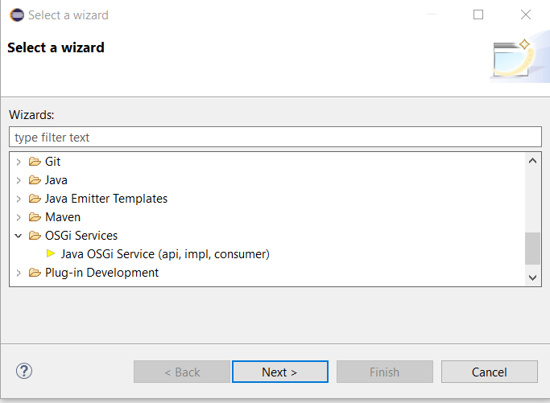
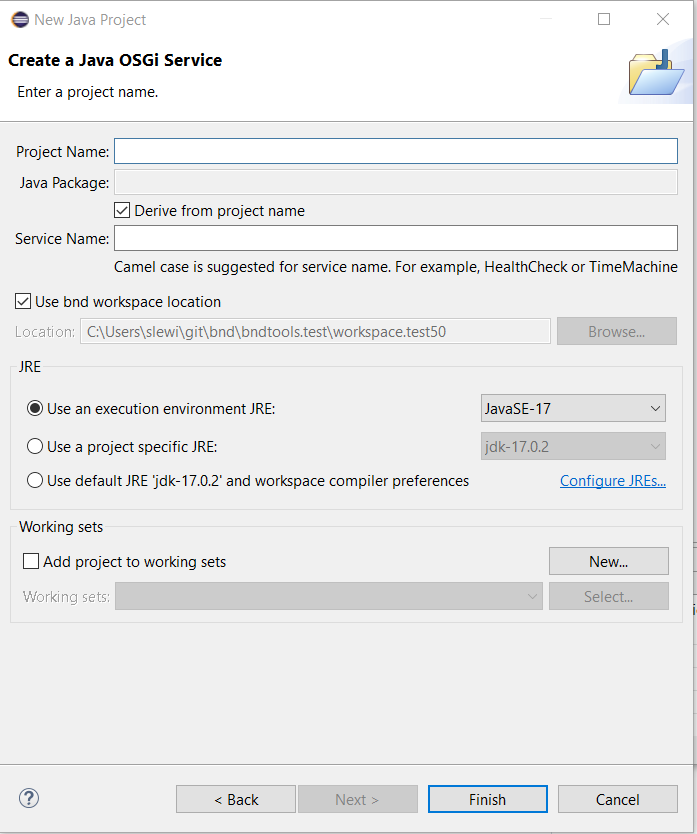
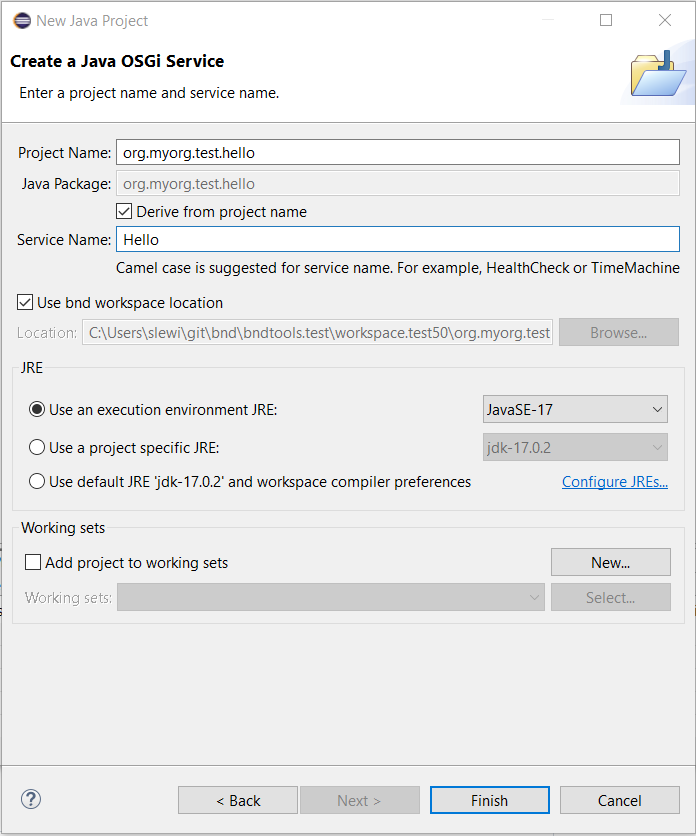
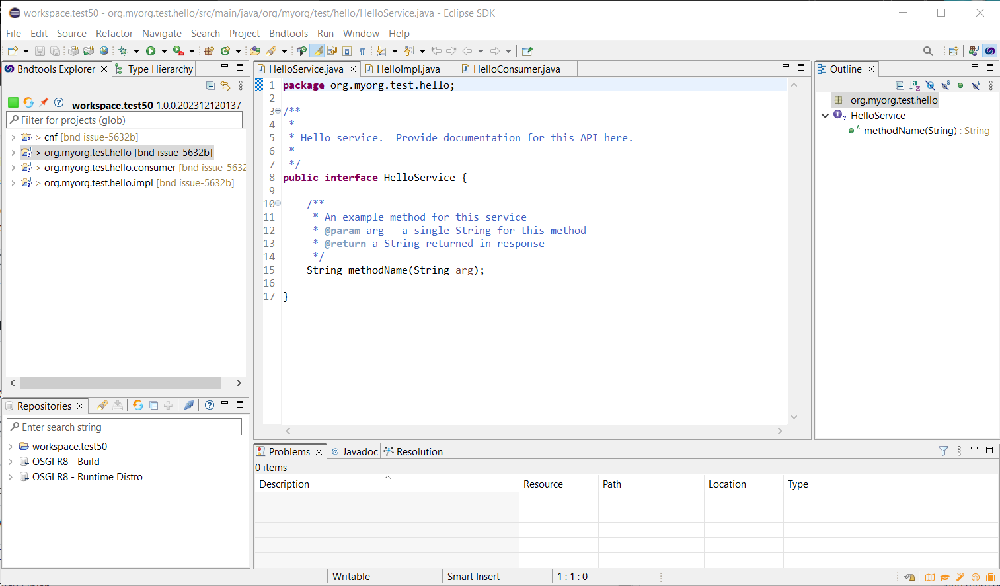
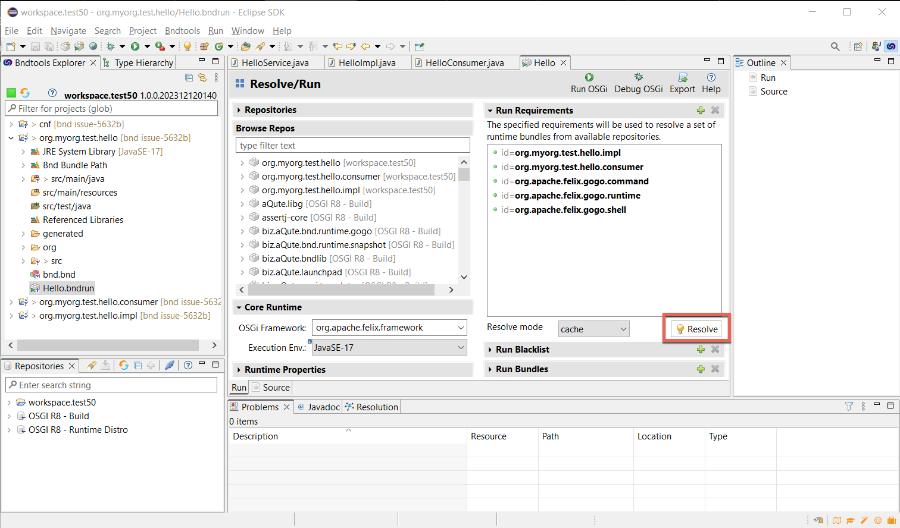
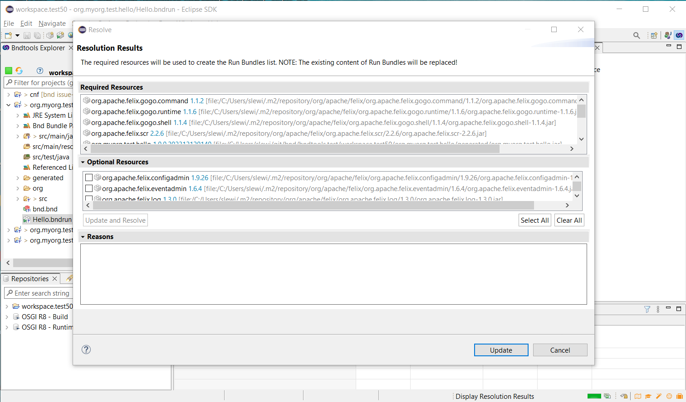
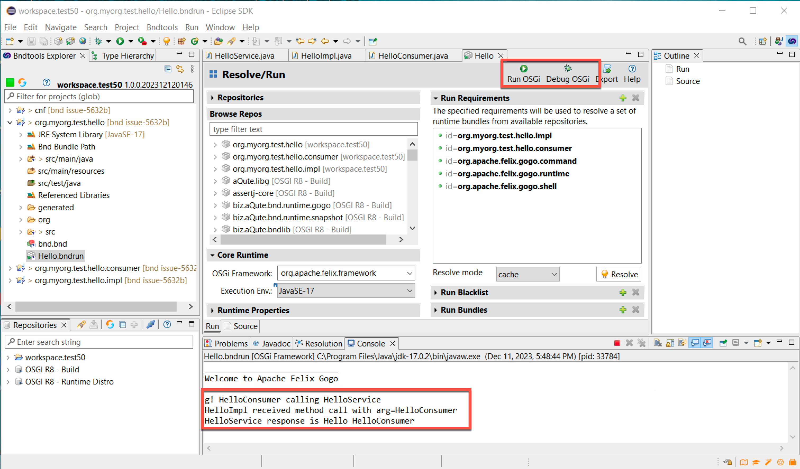

## Java OSGi Service (api, impl, consumer)

This template is based on the idea of [this tutorial](../tutorial.html) and will create three bundles for a typical OSGi service scenario:
- api bundle - contains the interface of a service
- impl bundle - contains the implementation class (`@Component`) of the service interface
- consumer bundle - contains an example of a class which consumes the service without relying on the implementation directly but letting the OSGi Framework inject it by `@Reference`

**Requirements**: 
- bndtools Eclipse-Plugin has been installed
- a new [Bnd Workspace](../workspace.html) has been created (e.g. using the bndtools.workspace.min template)

### 1. Open the wizard, select File->New->Other...

### 2. Then select OSGi Services -> Java OSGi Service (api, impl, consumer) and Next>

### 3. Fill in desired values for the Project Name and the Service Name fields, and make any other desired changes to the execution environment or project set usage on the wizard page.

### 4. Click Finish

There are three projects created org.myorg.test.hello (api), org.myorg.test.hello.impl, and org.myorg.test.hello.consumer.

The three Java classes created (in each of the projects) are shown in the edit window (HelloService, HelloServiceImpl, HelloServiceConsumer).

If desired, the user can use Eclipse refactoring to rename the default service method (named methodName) to (e.g.) hello, resulting in:

### 5. Run/Debug the project

Included in the generated `org.myorg.test.hello` project is a `Hello.bndrun` file that can be used to launch a framework, register the HelloServiceImpl, inject (via SCR) into the HelloServiceConsumer and have the HelloServiceConsumer call the service.

### 6. Resolving dependencies

Click `Resolve` and the `Update` to let bndtools figure out the bundles to run (-runbundles).

### 7. Run the project

Then clicking on Run OSGi (or Debug OSGi). Results in the service method being called and the console output.

### Next steps

Now you have a good starting point to develop your service. 
In an existing project you probably do not need the generated consumer bundle if you already have other bundles consuming the service. Feel free to remove this generated bundle then (you may need to remove this bundle from the `.bndrun` `-runbundles` section).