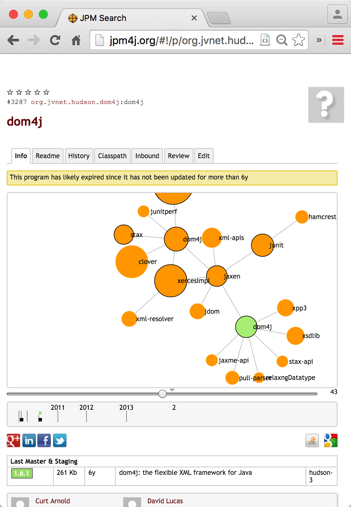
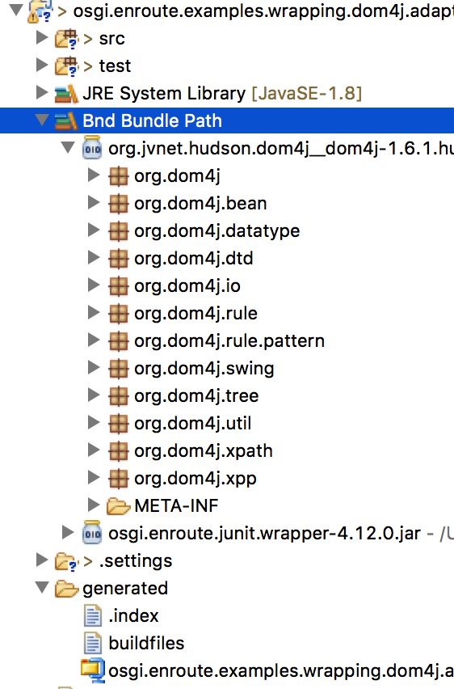

In this tutorial we will wrap [DOM4J]. This JAR is available on Maven Central. The latest versions are actually OSGi enabled but there are variations around without manifest headers. It is chose because its dependencies are not too awful. It also depends on a number of external libraries that each also have dependencies, ad nauseum. 

> ##### WARNING
>
> The work we do in this tutorial **is not for use in a real bundle**. The resulting bundle is not tested an might not work. The only goal is to show the forces at play when you wrap a bundle.
{: .block-warning }

## Dependencies of DOM4J

Below you see the dependency graph of revision 1.6.1. For an average Maven project this actually looks quite good. (The graph shows all Maven dependencies, this is in general a bit too wide since test and compile dependencies are not transitive.) However, if a project does not stop at the maximum number of shown dependencies (>1000) then it is generally a 'good' sign.

{: width="70%" }

On Maven Central you can see this in the [Dependencies tab](https://central.sonatype.com/artifact/dom4j/dom4j/1.6.1/dependencies).

After we created the project, we'll drag the top version vignette on the `bnd.bnd` build tab to add it as a dependency.

## Creating Project

In Bndtools create a project `osgi.enroute.examples.wrapping.dom4j.adapter`. It is of course fine to call it differently but make sure you call make the extension `adapter` or `provider`. This extension triggers the correct template with the OSGi enRoute templates, which you should obviously use.

After the creation, you can delete the source code in the `src` and `test` source folders; we won't use it. (Add a `.gitignore` file in the `src` folder so that it is not ignored as an empty directory by Git.)

## Adding DOM4J

First, add the Maven GAV coordinates, i.e. `dom4j:dom4j:1.6.1` to your repository in bndtools (e.g. [MavenBndRepository](https://bnd.bndtools.org/plugins/maven.html))

Then double click on the `bnd.bnd` file in your project and select the `Build` tab. Now drag the domj bundle from the Repository Browserto the `Build` tab's  `Build Path` list and drop it. Alternatively you can achieve the same by using the `+` Button of the `Build Path` list.

Then, click on the `Source` tab. The `-buildpath` looks then like:

	-buildpath: \
		dom4j:dom4j;version='1.6'

## Version & Description

In general you use the version of the JAR you're wrapping. Since we're wrapping 1.6.1 we make that our own version. It is also a good idea to add a small description of what you are doing. So you should replace the Bundle-Version and Bundle-Description headers. Adding a Bundle-Copyright and Bundle-Vendor cannot harm:

	Bundle-Version:			1.6.1.${tstamp}
	Bundle-Description:		Wraps DOM4J for OSGi, including the primary dependencies
	Bundle-Copyright:		OSGi enRoute
	Bundle-Vendor:			OSGi Alliance
	
## Build Path

If you save the `bnd.bnd` file then the DOM4J JAR is added to your _build path_. We can inspect the contents by 
looking in the Eclipse Class Path container. This is the little bookshelf with the title: `Bnd Bundle Path`. The little arrow on the left allows you to open the container to see the contents. Also open the `dom4j-1.6.1` member of this container.

{: width="70%" }

## Exporting

Inspecting the list of packages inside the `dom4j-1.6.1` JAR shows that all package names start with  `org.dom4j`. We therefore start by exporting these packages. The easiest way to do this to stay in the `Source` tab and add the text:

	Export-Package: org.dom4j.*

This will export all packages on the `-buildpath` that start with `org.dom4j`! 

## The Bundle

We've actually generated the bundle now. If you look in the folder `generated` then you'll find the JAR  . Opening this JAR in the JAR Editor that is included with Bndtools will show you the manifest. (The `Print` tab is a little more readable.) This manifest looks (slightly reformatted) like:

	[MANIFEST osgi.enroute.examples.wrapping.dom4j.adapter.jar]
	Bnd-LastModified                         1458829936934                           
	Bundle-Copyright                         OSGi enRoute
	Bundle-Description                       Wraps DOM4J for OSGi, including 
	                                         the primary dependencies
	Bundle-ManifestVersion                   2                                       
	Bundle-Name                              osgi.enroute.examples.wrapping.dom4j.adapter
	Bundle-SymbolicName                      osgi.enroute.examples.wrapping.dom4j.adapter
	Bundle-Vendor			                 OSGi Alliance
	Bundle-Version                           1.6.1.201603241432                      
	Created-By                               1.8.0_25 (Oracle Corporation)           
	Import-Package                           com.sun.msv.datatype,
	                                         com.sun.msv.datatype.xsd,
	                                         javax.swing.table, 
	                                         javax.swing.tree, 
	                                         javax.xml.namespace, 
	                                         javax.xml.parsers,
	                                         javax.xml.stream,
	                                         javax.xml.stream.events,
	                                         javax.xml.stream.util,
	                                         javax.xml.transform.sax,
	                                         org.gjt.xpp,
	                                         org.jaxen,org.jaxen.dom4j,
	                                         org.jaxen.pattern,
	                                         org.jaxen.saxpath,
	                                         org.relaxng.datatype,
	                                         org.w3c.dom,
	                                         org.xml.sax,
	                                         org.xml.sax.ext,
	                                         org.xml.sax.helpers,
	                                         org.xmlpull.v1
	Manifest-Version                         1.0                                     
	Private-Package                          org.dom4j.rule.pattern, 
                                             org.dom4j.swing,
                                             org.dom4j.tree,
                                             org.dom4j.dtd,
                                             org.dom4j.util,
                                             org.dom4j.xpp,
                                             org.dom4j,
                                             org.dom4j.bean,
                                             org.dom4j.datatype,
                                             org.dom4j.rule,
                                             org.dom4j.io,
                                             org.dom4j.xpath
	Require-Capability                       osgi.ee;filter:="(&(osgi.ee=JavaSE)(version=1.3))"
	Tool                                     Bnd-3.2.0.201603172351-SNAPSHOT         

Obviously we succeeded in including the `org.dom4j` packages but we got a few imports that are not in the JVM like `org.jaxen`, `org.gjt.xpp`, and `org.relaxng`.
 

[DOM4J]: http://jpm4j.org/#!/p/org.jdom/jdom
[JPM4J]: http://jpm4j.org/
[-conditionalpackage]: http://bnd.bndtools.org/instructions/conditionalpackage.html
[blog]: http://njbartlett.name/2014/05/26/static-linking.html
[133 Service Loader Mediator Specification]: http://blog.osgi.org/2013/02/javautilserviceloader-in-osgi.html
[semanticaly versioned]: http://bnd.bndtools.org/chapters/170-versioning.html 
[135.3 osgi.contract Namespace]: http://blog.osgi.org/2013/08/osgi-contracts-wonkish.html
[BSD style license]: http://dom4j.sourceforge.net/dom4j-1.6.1/license.html
[supernodes of small worlds]: https://en.wikipedia.org/wiki/Small-world_network
[OSGiSemVer]: https://www.osgi.org/wp-content/uploads/SemanticVersioning.pdf
[osgi.enroute.examples.wrapping.dom4j.adapter]: https://github.com/osgi/osgi.enroute.examples/tree/485624f6cb66df91f668d6eb9a5c8e491312c8c4/osgi.enroute.examples.wrapping.dom4j.adapter