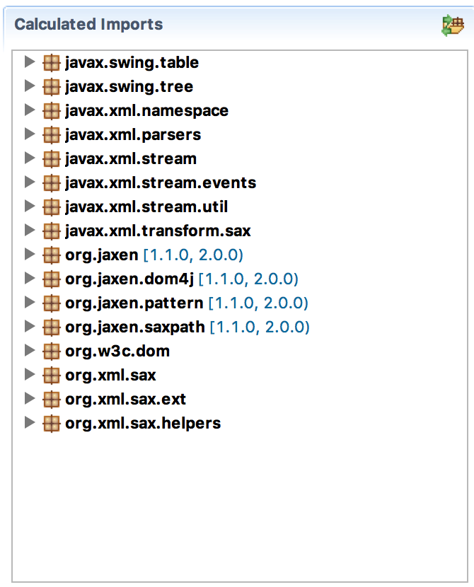

When we look in the `Bnd Bundle Path`, in the repository we can see that `org.jaxen` is an OSGi bundle. So in that case we could allow the import of its packages instead of wrapping it inside our bundle.

When to refer and when to include. In general, dependencies are evil. Adding a dependency to save a few bytes is [usually not worth it](http://www.theregister.co.uk/2016/03/23/npm_left_pad_chaos/). When systems become complex it quickly becomes really problematic to ensure that no two dependencies conflict on their versions. Though OSGi can handle multiple versions in a JVM, the consequences are still not anything to be desired for a reliable application. 

In a perfect world the only dependencies are therefore APIs to an _abstraction_ of a shared functionality. For example, you cannot include an Event Admin implementation because the whole purpose of that service is that it is shared between all bundles. However, you can include an ASM bytecode manipulation library since it is perfectly okay that different bundles use different versions of this library as long as they do not interchange types of it. 	

Anyway. To make `jaxen` bundle an external dependency we need to add the `org.jaxen` packages to the `-conditionalpackage` instruction with a '!' so they will not be included in our bundle.

	-conditionalpackage: \
	  !javax.*, \
	  !org.xml.*, \ 
	  !org.w3c.*, \
	  !org.ietf.jgss, \
	  !org.omg.*, \
	  !org.jaxen.*, \
	  *

We could of course remove it from our `-buildpath` so bnd could not find it. That is, however, a bad idea. By leaving it on the `-buildpath` we allow bnd to _learn_ the versions of the packages so it can properly version the packages in our target bundle. If we look at our imports now in the `Contents` tab:

{: width="50%"}

We can see that the org.jaxen package is now imported with a real version range.       

One down, some more to go. What if we want to _optionally_ depend on something? Stay tuned.

[DOM4J]: http://jpm4j.org/#!/p/org.jdom/jdom
[JPM4J]: http://jpm4j.org/
[-conditionalpackage]: http://bnd.bndtools.org/instructions/conditionalpackage.html
[blog]: http://njbartlett.name/2014/05/26/static-linking.html
[133 Service Loader Mediator Specification]: http://blog.osgi.org/2013/02/javautilserviceloader-in-osgi.html
[semanticaly versioned]: http://bnd.bndtools.org/chapters/170-versioning.html 
[135.3 osgi.contract Namespace]: http://blog.osgi.org/2013/08/osgi-contracts-wonkish.html
[BSD style license]: http://dom4j.sourceforge.net/dom4j-1.6.1/license.html
[supernodes of small worlds]: https://en.wikipedia.org/wiki/Small-world_network
[OSGiSemVer]: https://www.osgi.org/wp-content/uploads/SemanticVersioning.pdf
[osgi.enroute.examples.wrapping.dom4j.adapter]: https://github.com/osgi/osgi.enroute.examples/tree/485624f6cb66df91f668d6eb9a5c8e491312c8c4/osgi.enroute.examples.wrapping.dom4j.adapter