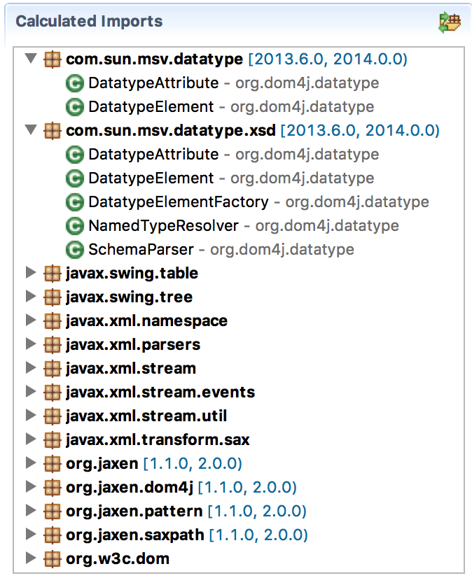
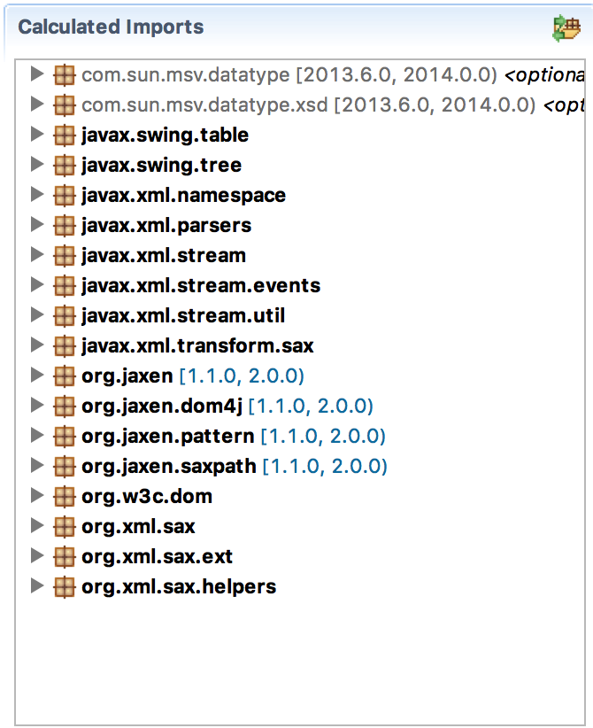

If we inspect list of included packages we find that `com.sun.msv.datatype` and `com.sun.msv.datatype.xsd` are included from  `net.java.dev.msv.xsdlib`. They drag in quite a few classes so we would like to reference these as imports as well. (They are proper bundles.) However, we suspect that most of DOM4J would work without these dependencies. (Okay, strike that, we just make the unverified assumption.)

You will often find the same structure in JARs. There is a core of highly interconnected packages and then there are a number of _satellite packages_ that import the core  and some external dependency. In vein with the [supernodes of small worlds], these are the super packages. These packages _bridge_ the internal core with other, often large subsystems. It always is worth to pay attention to these _superpackages_ because they are often:

* Not required by the core
* Only needed when they are included in an application that already contains the bridged subsystem

So these are typical _optional_ dependencies. We can leverage it when it is there, but we don't need it and we don't want to force our users to include it. For example, if a bytecode manipulation library includes a Maven plugin then it will have a dependency on the whole of Maven because it uses its API. Obviously, this will make the library not popular in Gradle or in a non-build tool environment. 

In OSGi, we can mark imported packages as optional by adding the directive `resolution:=optional` to the import package clause.

So let us do an experiment. Lets add the package prefix `com.sun.*` to our `-conditionalpackage` instruction. This will then make us import the dependency. In the `Contents` tab we can then look which class is actually referring to those packages.

	-conditionalpackage: \
	  !javax.*, \
	  !org.xml.*, \ 
	  !org.w3c.*, \
	  !org.ietf.jgss, \
	  !org.omg.*, \
	  !org.jaxen.*, \
	  !com.sun.*, \
	  *

Save the file and open the `Contents` tab.

{: width="50%" }

As you can see in the previous picture, the classes that refer to the imported packages are now listed in the `Calculated Imports` list. From this we can take the decision if we make it an optional import because those classes. As stated before, lets assume these are bridge classes so the `com.sun.msv.datatype` and `com.sun.msv.datatype.xsd` are only needed in special occasions. (Again, we assume, we don't know for real.)

We can augment the Import-Package header as follows:

	Import-Package: \
	  com.sun.msv.datatype.*; resolution:=optional, \
	  *

We can now look again at the `Contents` tab to see that the `com.sun.msv.datatype.*` packages are optionally imported. They have become gray and show `optional`:

{: width="50%" }

We've now made the `com.sun.msv` packages optional. However, in certain cases you just want to ignore the import because you have knowledge that the import can never be used. (Though the punishment for being wrong are hard to diagnose errors.)

[DOM4J]: http://jpm4j.org/#!/p/org.jdom/jdom
[JPM4J]: http://jpm4j.org/
[-conditionalpackage]: http://bnd.bndtools.org/instructions/conditionalpackage.html
[blog]: http://njbartlett.name/2014/05/26/static-linking.html
[133 Service Loader Mediator Specification]: http://blog.osgi.org/2013/02/javautilserviceloader-in-osgi.html
[semanticaly versioned]: http://bnd.bndtools.org/chapters/170-versioning.html 
[135.3 osgi.contract Namespace]: http://blog.osgi.org/2013/08/osgi-contracts-wonkish.html
[BSD style license]: http://dom4j.sourceforge.net/dom4j-1.6.1/license.html
[supernodes of small worlds]: https://en.wikipedia.org/wiki/Small-world_network
[OSGiSemVer]: https://www.osgi.org/wp-content/uploads/SemanticVersioning.pdf
[osgi.enroute.examples.wrapping.dom4j.adapter]: https://github.com/osgi/osgi.enroute.examples/tree/485624f6cb66df91f668d6eb9a5c8e491312c8c4/osgi.enroute.examples.wrapping.dom4j.adapter