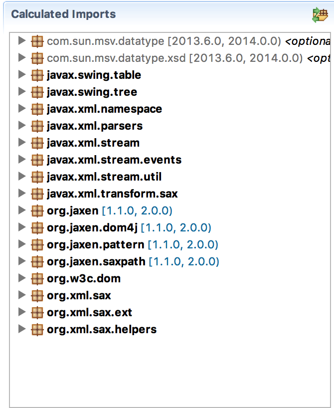

Further inspecting the list of included packages we see that we include two pull parsers:

	xmlpull__xmlpull
	pull-parser__pull-parser

They both are quite old and (11 and 6 years) and not OSGi bundles. For the sake of this example, lets ignore the `xmlpull__xmlpull` dependency.

	-conditionalpackage: \
	  !javax.*, \
	  !org.xml.*, \ 
	  !org.w3c.*, \
	  !org.ietf.jgss, \
	  !org.omg.*, \
	  !com.sun.*, \
	  !org.jaxen.*, \
	  !org.xmlpull.*, '\
	  *

Inspecting the `Contents` tab, we can see that this imports `org.xmlpull.v1`. Since we do not want to create a dependency to a package that is not from a bundle, not even optional, we are going to ignore this import.

In bnd, imports are controlled via the Import-Package header/instruction. By default, this header is `*`, the wildcard. This means that any import that is found by analyzing the bytecodes is added to the manifest. We can use this list to decorate the packages with attributes and directives. However, we can also use it to ignore certain packages. Ignoring is done in the same way as we do in the `-conditionalpackage` instruction, with the _bang_ (exclamation mark, '!'). Don't forget to end the instruction/header with the wildcard or you'll skip all imports.

	Import-Package: \
	  com.sun.msv.datatype.*; resolution:=optional, \
	  !org.xmlpull.*, \
	  *

If we now look at the imports in the generated directory then we see:

{: width="50%"}

No more XML Pull parsing! Caveat: If the pull parser is used internally then you're of course pickled. The effect will be a Class Not Found exception that any users will make them want to pull their hair out, or do that kind of activity to you. So don't do these tricks and publish the results until you really figured out that it cannot do any harm. 

[DOM4J]: http://jpm4j.org/#!/p/org.jdom/jdom
[JPM4J]: http://jpm4j.org/
[-conditionalpackage]: http://bnd.bndtools.org/instructions/conditionalpackage.html
[blog]: http://njbartlett.name/2014/05/26/static-linking.html
[133 Service Loader Mediator Specification]: http://blog.osgi.org/2013/02/javautilserviceloader-in-osgi.html
[semanticaly versioned]: http://bnd.bndtools.org/chapters/170-versioning.html 
[135.3 osgi.contract Namespace]: http://blog.osgi.org/2013/08/osgi-contracts-wonkish.html
[BSD style license]: http://dom4j.sourceforge.net/dom4j-1.6.1/license.html
[supernodes of small worlds]: https://en.wikipedia.org/wiki/Small-world_network
[OSGiSemVer]: https://www.osgi.org/wp-content/uploads/SemanticVersioning.pdf
[osgi.enroute.examples.wrapping.dom4j.adapter]: https://github.com/osgi/osgi.enroute.examples/tree/485624f6cb66df91f668d6eb9a5c8e491312c8c4/osgi.enroute.examples.wrapping.dom4j.adapter