# Introduction

In this tutorial we will build a sample application composed of two components and an API. The following diagram shows the bundle architecture (simplified):


In the tutorial we create the top three bundles (rectangles):

* The API bundle exports a service interface, `Greeting`.
* The Provider bundle imports the interface and publishes an instance of the service.
* The Command bundle imports the interface and binds to the service instance, and also publishes a `Command` service that is used by the Felix Shell bundle.

# Installing Bndtools

Please refer to the [Installation Instructions](installation.html).

# Create a Bndtools Workspace

If your current workspace is not configured as a Bnd Workspace yet, before creating a project, we need to set up the Bnd OSGi Workspace.  

1. Switch to the Bndtools view

2. From the File menu, select **New -> Bnd OSGi Workspace**

3. A wizard will open and it should look like the one in the figure

   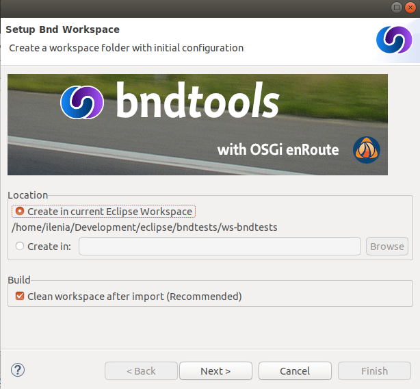

4. Select the location in your file system to be linked to the workspace (the default one is your current Eclipse workspace location) and then press **Next**

5. In the next page of the wizard select from the templates **bndtools/workspace** and press **Next**

6. The next page is simply an overview of the files that will be automatically included. Just press **Finish**

7. You should end up with a new **cnf** folder in your workspace. If you expand it, you should see something similar to this figure.

   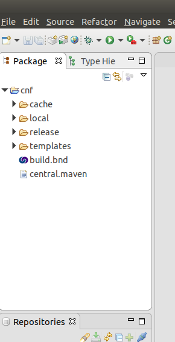

If this is the case, you are now ready to create your first Bnd OSGi project!

# Create an API Project

First we need to create a Bnd OSGi Project. This is just a standard Eclipse Java Project, with an additional builder for constructing OSGi bundles.

1. From the File menu, select **New -> Bnd OSGi Project**.

2. A wizard should open and you should see something which looks like this:

   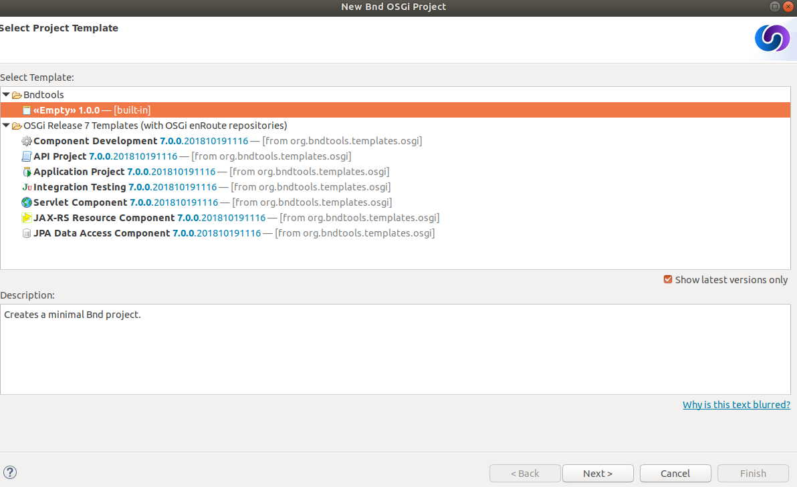

3. As you see, you have the possibility to choose among a series of templates or to create a new project from scratch. For this first tutorial we will start with an empty project, thus, select the **Empty** option and press **Next**

4. On the next page, you will be asked to enter the name of the project. Please, enter `org.example.api` in this case. Select then the JRE execution environment (at least J2SE-1.5) and press **Next**

   

5. In the following page you will see an overview of the folders that will be created for this new project.

   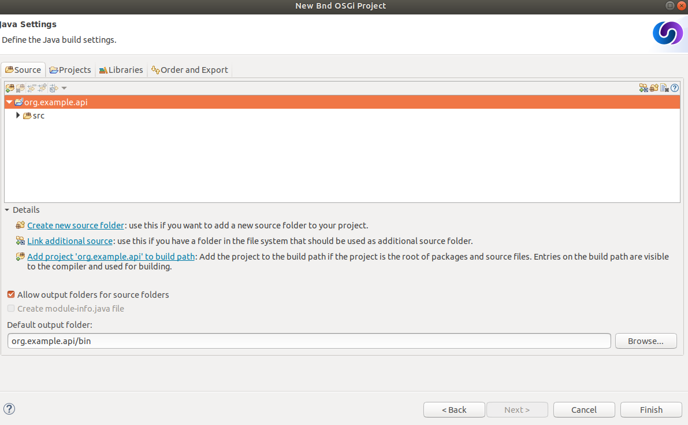

6. You can now press **Finish** and your new project will be created.

*Important Points:*

* Bndtools projects are based on standard Eclipse Java (JDT) projects.
* Bndtools uses a `cnf` project containing workspace-wide configuration that is normally shared between developers. It may also contain a repository of bundles.
* A file named `bnd.bnd` is created at the top of each Bndtools project, which controls the settings for the project. The same settings are used by bnd when it is invoked from an offline ANT build.

## Write and Export the API

OSGi offers strong decoupling of producers and consumers of functionality. This is done by encouraging an API-based (or in Java terms, interface-based) programming model, where producers of functionality implement APIs and the consumers of functionality bind only to APIs, not any particular implementation. For our example we will use a fairly trivial API.

In the `src` directory of the new project, create a package named `org.example.api`. In the new package create a Java interface named `Greeting`, as follows:

```java
package org.example.api;

public interface Greeting {
    String sayHello(String name);
}
```

## Define the Bundle

The project we have created defines a single bundle with a Bundle Symbolic Name (BSN) of `org.example.api` (i.e., the same as the project name). As soon as we created the project, a bundle file named `org.example.api.jar` was created in the `generated` directory, and it will be rebuilt every time we change the bundle definition or its source code.

However, the bundle is currently empty, because we have not defined any Java packages to include in the bundle. This is an important difference of Bndtools with respect to other tools: bundles are always empty until we explicitly add some content. You can verify this by double-clicking the bundle file and viewing its contents: it will only have a `META-INF/MANIFEST.MF` entry.

We want to add the package `org.example.api` to the exported packages of the bundle. So open the `bnd.bnd` file at the top of the project and select the **Contents** tab. Now the package can be added in one of two ways:

* Click the "+" icon in the header of the **Export Packages** section, then select `org.example.api` from the dialog and click **OK**... *or*
* Drag-and-drop the package `org.example.api` from Eclipse's Package Explorer view into the **Export Packages** list.

(TIP: Advanced users may prefer to enter `Export-Package: org.example.api` manually in the **Source** tab).

As soon as this is done, a popup dialog appears titled "Missing Package Info". This dialog is related to package versioning: it is asking us to declare the version of this exported package. Click **OK**.


The **Contents** tab should now appear as in the following screenshot:

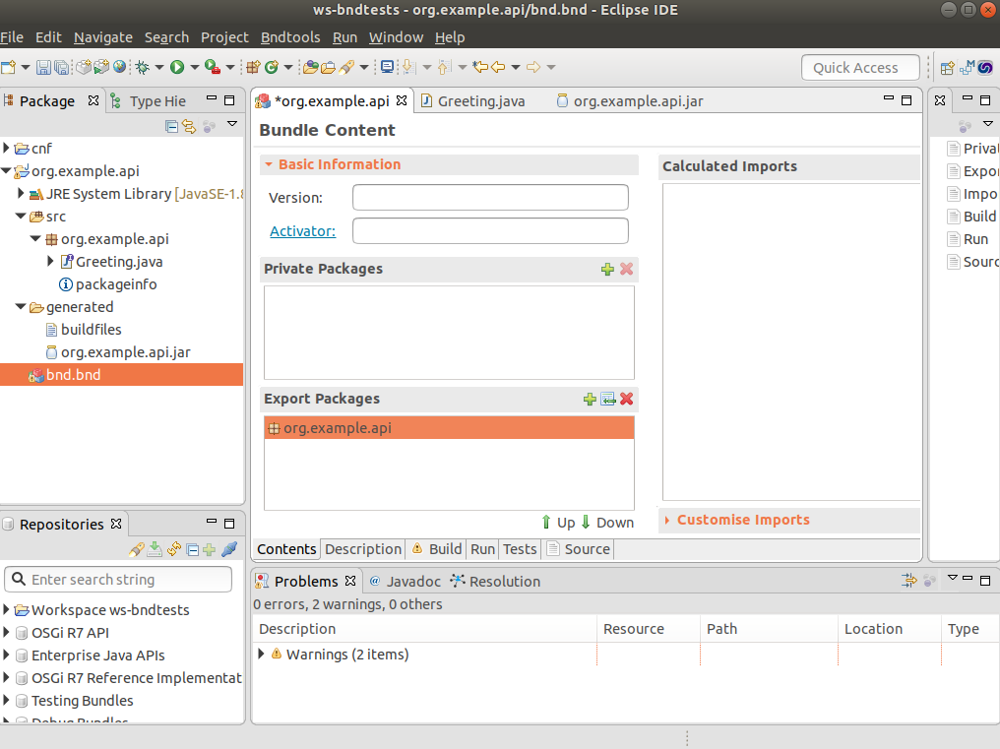

Save the file, and the bundle will be rebuilt to include the selected export.

*Important Points:*

* The project configuration and the bundle contents are defined by `bnd.bnd`.
* The identity of a bundle -- its "Bundle Symbolic Name" or BSN -- is controlled by the project name. In this case, the bundle's BSN is equal to the project name.
* Bundles are always empty until we explicitly add contents to them. Adding a package to the **Export Packages** panel included that package in the bundle, and also declared it as an export in the `META-INF/MANIFEST.MF`.
* *Normally* bundles contain more than just a single interface. This example is intentionally simplistic.

# Create an Implementation Project

We will now create another project that defines two bundles: a provider and a client of the `Greeting` API.

## Create the Project

Create another Bnd OSGi project, named `org.example.impl`. At the **Project Templates** step, select **Component Development** and then proceed as for the previous project.

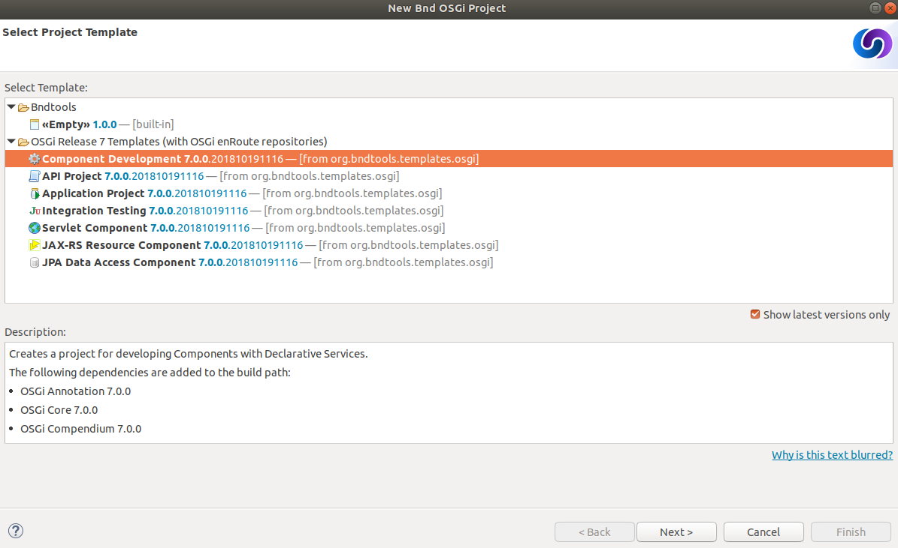

## Add the API as a Build Dependency

We need to add the API project as a build-time dependency of this new project.

The `bnd.bnd` file of the newly created project will have opened automatically. Click the **Build** tab and add `org.example.api` in either of the following ways:

* Click the "+" icon in the toolbar of the **Build Path** panel. Double-click `org.example.api` under "Workspace" in the resulting dialog; it will move over to the right-hand side. Click **Finish**

   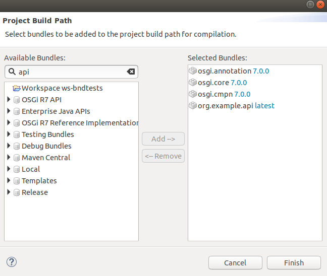

* **OR** drag-and-drop `org.example.api` from the **Repositories** view into the **Build Path** panel.

In either case, the `org.example.api` bundle will appear in the **Build Path** panel with the version annotation "latest":

   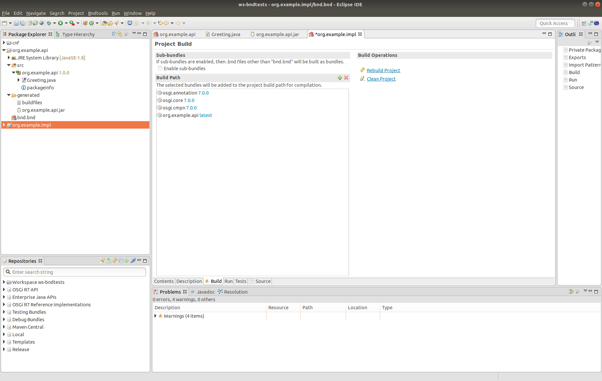

* Save the file.

*Important Points:*

* Build-time dependencies of the project can be added in the **Build Path** panel of the `bnd.bnd` editor.
* Adding dependencies in this way (i.e. rather than via Eclipse's existing "Add to Build Path" menu) ensures that exactly the same dependencies are used when building off-line with ANT.

## Write an Implementation

We will write a class that implements the `Greeting` interface. When the project was created from the template, a  Java source for a class named `org.example.impl.Example` was generated. Open this source file now and make it implement `Greeting`:

```java
package org.example.impl;

import org.example.api.Greeting;

import aQute.bnd.annotation.component.Component;

@Component
public class Example implements Greeting {
    public String sayHello(String name) {
        return "Hello " + name;
    }
}
```

Note the use of the `@Component` annotation. This enables our bundle to use OSGi Declarative Services to declare the API implementation class. This means that instances of the class will be automatically created and registered with the OSGi service registry. The annotation is build-time only, and does not pollute our class with runtime dependencies -- in other words, this is a "Plain Old Java Object" or POJO.

## Test the Implementation

We should write a test case to ensure the implementation class works as expected. In the `test` folder, a test case class already exists named `org.example.ExampleTest`. 

```java
package org.example.impl;

import static org.junit.Assert.*;

import org.junit.Test;

public class ExampleTest {

    @Test
    public void test() {
        fail("Not yet implemented");
    }
}
```

Use the already provided test method and substitute its implementation with the following:

```java
package org.example.impl;

import static org.junit.Assert.*;

import org.junit.Test;

public class ExampleTest {

    @Test
    public void test() throws Exception {
        String result = new Example().sayHello("Bob");
        assertEquals("Hello Bob", result);
    }
}
```

Now right-click on the file and select **Run As > JUnit Test**.


Verify that the **JUnit** view shows a green bar. If not, go back and fix the code!

Note that, since this is a unit test rather than an integration test, we did not need to run an OSGi Framework; the standard JUnit launcher is used. Again, this is possible because the component under test is a POJO.

## Build the Implementation Bundle

As in the previous project, a bundle is automatically built based on the content of `bnd.bnd`. In the current project however, we want to build *two* separate bundles. To achieve this we need to enable a feature called "sub-bundles".

Right-click on the project `org.example.impl` and select **New > Bundle Descriptor File (.bnd)**. In the resulting dialog,  type the name `provider` for the Bnd File name and click **Finish**.

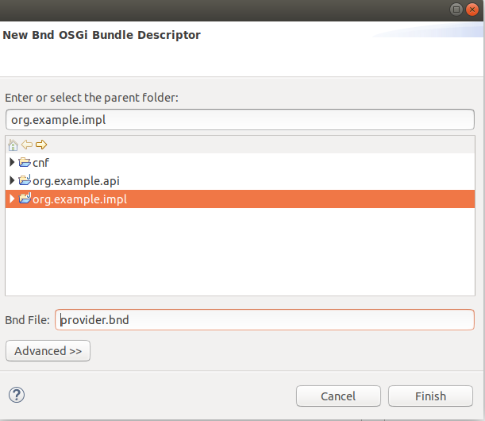

A popup dialog will ask whether to enable sub-bundles. Click **OK**.

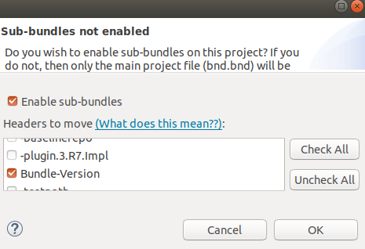

Some settings will be moved from `bnd.bnd` into the new `provider.bnd` file. Add the package `org.example.impl` to the **Private Package** of this newly created file. You should now find a bundle in `generated` named `org.example.impl.provider.jar` which contains the `org.example` package and a Declarative Services component declaration in `OSGI-INF/org.example.impl.Example.xml`.

*Important Points:*

* Bndtools project can output either a single bundle or multiple bundles.
* In the case of single-bundle projects, the contents of that bundle are defined in `bnd.bnd`.
* In the case of multi-bundle projects, the contents of each bundle is defined in a separate `.bnd` file. The `bnd.bnd` file is still used to define project-wide settings, such as build dependencies.

# Run an OSGi Framework

We'd now like to run OSGi. To achieve this we need a "Run Descriptor" that defines the collection of bundles to run, along with some other run-time settings. This file is automatically created with the **Component Development** project template that we have used, and it is named `launch.bndrun`.

For creating a new "Run Descriptor", in case you would need more than one, right-click on the project `org.example.impls` and select **New > Run Descriptor File (.bndrun)** . In the resulting dialog you will be asked to select a "Run Descriptor" from a template. Choose the **Felix 4+** option and click **Next**.  

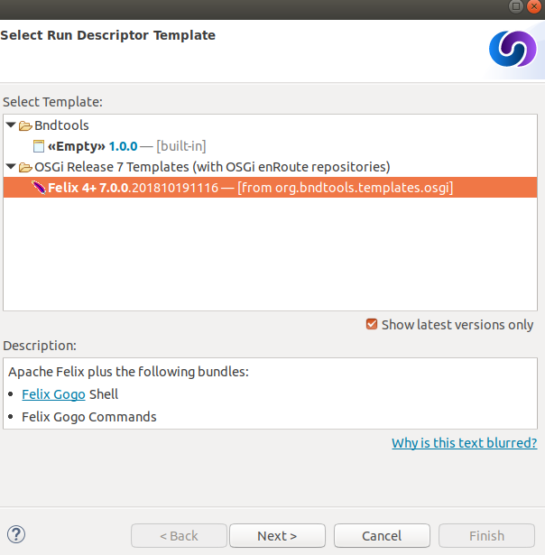

In the next page enter the name of the file and click  **Finish**.

In the editor for your `launch.bndrun` file, click on **Run OSGi** near the top-right corner. Shortly, the Felix Shell prompt "`g!`" will appear in the **Console** view. Type the `lb` command to view the list of bundles:

```shell
Welcome to Apache Felix Gogo

g! lb
START LEVEL 1
   ID|State      |Level|Name
    0|Active     |    0|OSGi System Bundle (3.13.100.v20180827-1536)|3.13.100.v20180827-1536
    1|Active     |    1|Apache Felix Gogo Runtime (1.0.10)|1.0.10
    2|Active     |    1|Apache Felix Gogo Shell (1.0.0)|1.0.0
    3|Active     |    1|Apache Felix Gogo Command (1.0.2)|1.0.2
g!
```

Next we want to include the `org.example.impls.provider` and `osgi.cmpn` bundles. This can be done as follows:

* Click the "+" icon in the toolbar of the **Run Requirements** panel to open the 'Add Bundle Requirement' dialog.
* Under "Workspace", double-click `org.example.impls.provider`.
* Under "OSGi R7 API", double-click `osgi.cmpn`.
* Click **Finish**.

The **Run Requirements** panel should now look like this:

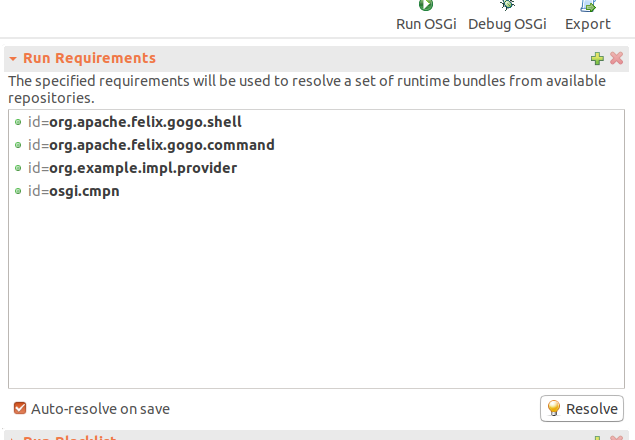

If is not already selected, please, select the **Execution Environment** in the **Core Runtime** session of the file.

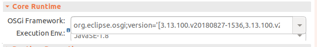

Check **Auto-resolve on save** and then save the file. Returning to the **Console** view, type `lb` again:

```shell
g! lb
START LEVEL 1
   ID|State      |Level|Name
    0|Active     |    0|OSGi System Bundle (3.13.100.v20180827-1536)|3.13.100.v20180827-1536
    1|Active     |    1|Apache Felix Gogo Runtime (1.0.10)|1.0.10
    2|Active     |    1|Apache Felix Gogo Shell (1.0.0)|1.0.0
    3|Active     |    1|Apache Felix Gogo Command (1.0.2)|1.0.2
    4|Active     |    1|Apache Felix Declarative Services (2.1.10)|2.1.10
    5|Active     |    1|org.example.api (0.0.0)|0.0.0
    6|Active     |    1|org.example.impl.provider (0.0.0.201910251118)|0.0.0.201910251118
    7|Active     |    1|osgi.cmpn (4.3.1.201210102024)|4.3.1.201210102024
g!
```

The provider bundle has been added to the runtime dynamically. Note that the API bundle and Apache Felix Declarative Services are also added because they resolved as dependencies of the provider.

We can now look at the services published by our provider bundle using the command `inspect capability service 6`:

```shell
g! inspect capability service 6
org.example.impl.provider_0.0.0.201910251121 [6] provides:
----------------------------------------------------------
service; org.example.api.Greeting with properties:
   service.id = 45
   service.bundleid = 6
   service.scope = bundle
   component.name = org.example.impl.Example
   component.id = 1
g!
```

Our bundle now publishes a service under the `Greeting` interface.

*Important Points:*

* Run-time configurations can be defined in a `.bndrun` file. Multiple different run configurations can be used, resulting in different sets of bundles, different OSGi Framework implementations etc.
* The set of bundles to include is derived from the **Run Requirements** list. Bndtools uses OBR resolution to resolve a list of bundles including their static dependencies.
* If the OSGi Framework is still running, then saving the `bndrun` file will cause the list of bundles to be dynamically updated. So we can add and remove bundles without restarting.
* Editing an existing bundle -- including editing the Java code that comprises it -- will also result in the bundle being dynamically updated in the runtime.

# Write a Command Component

Finally we will write a component that consumes the Greeting service and publishes a shell command that can be invoked from the Felix shell.

First we need to make the Felix shell API available to compile against. Open `bnd.bnd` and change to the **Build** tab. Add `org.apache.felix.gogo.runtime` to the list of build dependencies, and save the file:

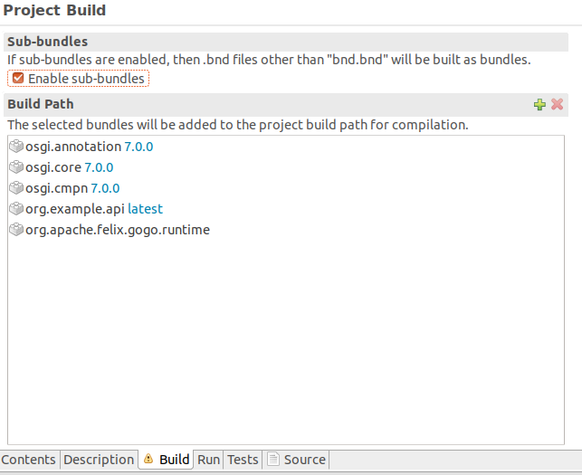

Now create a new Java package under the `src` folder named `org.example.command`. In this package create a class `GreetingCommand` as follows:

```java
package org.example.command;

import org.apache.felix.service.command.CommandProcessor;
import org.example.api.Greeting;
import org.osgi.service.component.annotations.Component;
import org.osgi.service.component.annotations.Reference;

@Component(property = {
        CommandProcessor.COMMAND_SCOPE + "=example",
        CommandProcessor.COMMAND_FUNCTION + "=greet"
    },
    service=GreetingCommand.class
)
public class GreetingCommand {
    private Greeting greetingSvc;

    @Reference
    public void setGreeting(Greeting greetingSvc) {
        this.greetingSvc = greetingSvc;
    }

    public void greet(String name) {
        System.out.println(greetingSvc.sayHello(name));
    }
}
```

## Create a Bundle for the Command Component

The command component is not part of the provider bundle, because it lives in a package that was not included. We could add it to the provider bundle, but it would make more sense to create a separate bundle for it.

Right-click again on the `org.example.impls` project and select **New > Bundle Descriptor File (.bnd)** again. Enter the name as `command` and click **Finish**.

Add the package `org.example.command` to the **Private Packages** panel of the newly created file. As before, this can be done using the "+" button in the toolbar or by drag-and-drop.

Then save the file.

## Add the Command Bundle to the Runtime

Switch back to the editor for `launch.bndrun`. In the **Run Requirements** tab, add the `org.example.impls.command` bundle, and save the file.

The command bundle will now appear in the list of bundles when typing `lb`:

```bash
g! lb
START LEVEL 1
   ID|State      |Level|Name
    0|Active     |    0|OSGi System Bundle (3.13.100.v20180827-1536)|3.13.100.v20180827-1536
    1|Active     |    1|Apache Felix Gogo Command (1.0.2)|1.0.2
    2|Active     |    1|Apache Felix Gogo Runtime (1.0.10)|1.0.10
    3|Active     |    1|Apache Felix Gogo Shell (1.0.0)|1.0.0
    4|Active     |    1|Apache Felix Declarative Services (2.1.10)|2.1.10
    5|Active     |    1|org.example.api (0.0.0)|0.0.0
    6|Active     |    1|org.example.impl.provider (0.0.0.201910250834)|0.0.0.201910250834
    7|Active     |    1|osgi.cmpn (4.3.1.201210102024)|4.3.1.201210102024
    8|Active     |    1|org.example.impl.command (0.0.0)|0.0.0
g!
```

Finally, the `greet` command will now be available from the Gogo shell:

```bash
g! greet BndTools
Hello BndTools
g!
```
