    
Table of Contents

*   [TL;DR](#tldr)
*   [Introduction](#introduction)
*   [Starting with OSGi](#starting-with-osgi)
*   [Gogo](#gogo)
*   [A New Gogo Command](#a-new-gogo-command)
*   [API Bundle](#api-bundle)
*   [Provider Bundle](#provider-bundle)
*   [JUnit Testing](#junit-testing)
*   [External Dependencies](#external-dependencies)
*   [Application](#application)
*   [Gradle](#gradle)
*   [Git](#git)
*   [Release to Remote Repository](#release-to-remote-repository)
*   [The End](#the-end)

## TL;DR

First, OSGi is about _complex_ systems. It is not some secret sauce library you can sprinkle over your application and hope it will be improved. It is a pretty fundamental choice. Therefore, if you find this document too long, you likely are not in the market for OSGi. OSGi shines for complex systems and not for a hello world example.

However, if you’re too hurried to do a nice cozy read of this book then I suggest you first follow the [Bndtool videos](http://bndtools.org/workspace.html). (And even those start with a TL;DR!). This document follows the same structure. If you then want to explore things in more detail you’re welcome back!

You can skip the introduction since it is a bit of smalltalk.

## Introduction

Documenting languages always seemed much more fun than elucidating OSGi. First, most developers can relate quickly to another language using examples like Hello World because the underlying concepts are so similar for most languages. However, some of the truly innovative things in OSGi are too unfamiliar to use such simplistic examples; they do require some effort from the student.

I generally addressed this large conceptual distance by making lots of pictures and diagrams, preferably with lots of animations. However, I often felt the audience drifting to thinking about what they should eat that evening instead of grasping these concepts.

I do not think I was alone in this because there are a large number of OSGi Hello World tutorials on the web where the accompanying text shows a certain disdain to OSGi developers. Why had we not explained OSGi better to them? Why were there no good tutorials explaining this simple and fantastic technology? It isn’t so hard? And with that, they made another "Hello World" tutorial that was as incomprehensible to a newcomer as the one they were rejecting.

I do take some comfort in that there were many of those tutorials, implying that these authors did not really learn that much from each other as the authors thought. Once you _get_ OSGi, it is actually quite simple and immensely powerful. However, to _get_ it, you actually need to _understand_ it. And that was the rub. OSGi often feels to newcomers like a tangled mess until just before the light goes on.

One day, while preparing a course, I realized that OSGi actually has a hidden gem called _Gogo_. Around 2008 I’d developed a Proof of Concept (PoC) of a [Command Line Interface](https://osgi.org/download/osgi-4.3-early-draft2.pdf) to launch and configure an OSGi framework. It combined the idea of an object-oriented language with the ease of use of a command-line shell like bash. It can basically do anything you can do in plain Java and it is trivial to add new commands from OSGi. It even supported piping commands.

The shell never became standardized by the [OSGi Alliance](https://www.osgi.org) since we felt that there was no real need to have a standardized shell. As long as the Framework was standardized, companies could pick any shell and still have portability. However, TSH was actually quite cool and I therefore donated it to Apache Felix, where it became _Gogo_. Several companies picked it up and the proof of concept was transformed into a serious piece of software, becoming quite successful over time. In particular the work to adapt it to Apache Karaf improved Gogo significantly. Even Equinox, the Eclipse framework, switched to Gogo as its primary shell.

Clearly, Gogo could be used in a minimal framework without any IDE. Though I am generally in the camp of learning from first principles, I felt that just having a framework with Gogo would not suffice. After all, OSGi is not about building small programs, OSGi is about beating complexity. When the environment cannot handle complexity it is really hard to show the benefits of OSGi.

Therefore, I decided to run Gogo inside _Bndtools_ to show the cool features of OSGi.

The bnd tool started around 2000 while I was working for Ericsson because I am lazy and distinctly disliked writing the required OSGi metadata in the manifest. Through Neil Bartlett, bnd turned into a very elegant Eclipse plugin called _Bndtools_. Over the past years, a large number of companies have adopted Bndtools and its sidekick Gradle.

A mature environment like Bndtools hides a lot of complexity that easily obscures important concepts. This makes it harder to see how things actually work under the hood. If it looks like magic it is hard to understand what is happening on the lower layers.

However, the advantage with Bndtools is that, out of the box, it creates correct bundles with no special setup. Since Bndtools can run OSGi frameworks in many different setups, it is easy to show all the aspects of OSGi. Most importantly, since Bndtools keeps a live framework updated of any changes in the IDE, OSGi feels like an _interactive_ environment, i.e. similar to a Repeat-Eval-Print-Loop (REPL) that makes so many languages a joy to learn. You change some Java code and it is available inside OSGi, using the dynamic nature of OSGi to do the updates. This dynamic nature makes it worth learning OSGi & bnd in Bndtools even if you use Maven as your build system. (bnd is present in Maven plugins.)

Therefore, this book uses a combination of the Gogo shell and Bndtools to explore OSGi. It starts by installing Bndtools and a _bnd workspace_. A playground project is then created to run a framework with the Gogo shell. From there, we first will explore the shell itself to learn the features. After feeling comfortable with the existing commands, we add a custom 'Hello World' command using the OSGi Declarative Services.

We go very lightly on the basic concepts in this book. We skip all the background and instead focus on building a trivial application that has the correct scalable architecture.

The next phase is, therefore, to create an absolutely minimal _workspace_ with an API project and a provider of this API, the architectural keystone of OSGi applications. We will explore how to test the code with plain JUnit both inside and outside an OSGi framework.

The core concept of OSGi is to build applications of reusable components. The previous sections created a reusable component so next comes the application. The application is the code that is never reusable, it only works for a specific environment and configuration.

The preferred delivery format in bnd is the _executable_ jar. This is a JAR file that contains a _launcher_, a framework, and all necessary dependencies. We show how to define an application project and export it automatically to an executable JAR. Such an executable JAR can then be deployed to the target environment.

If you are a user of a bnd workspace and there is _build master_ that maintains the low level details then you don’t need to continue with this document. It is then highly recommended to subscribe to the [Bndtools mailing list](https://bndtools.org/community.html).

The remainder of the document discusses how to:

*   Build the workspace with Gradle
    
*   Use Github Actions to build your workspace on a remote server
    
*   Release snapshots and releases to Sonatype Nexus repository
    

Enjoy! And do not forget to provide feedback to improve this document.

[Peter Kriens](mailto:peter.kriens@aQute.biz)

## Starting with OSGi

### TL;DR

This section will start with a hands-on deep dive into OSGi. We will install Bndtools and then create a playground project so we can explore OSGi and Bndtools in detail interactively. This kind of a crucial, and short, section to get started with Bndtools. It creates a running framework with a Gogo shell. This is very much the start level of all other chapters. So skip at your peril.

You can find a workspace with the work done in this book at [https://github.com/aQute-os/com.example](https://github.com/aQute-os/com.example). Please have a Java 8 VM installed.

You can follow a short video at [bndtools.org](https://bndtools.org/workspace.html#install).

### Installing

Install Eclipse & Bndtools. The following link can be used to find out how to install these tools.

*   [https://bndtools.org/installation.html](https://bndtools.org/installation.html)
    

The following sections assume that you have an empty Eclipse workspace up and running in a directory called `com.example`. This Eclipse workspace directory will also be used for bnd and later Git.

### About Java

Once upon a time, Java was stable for years but this changed after Java 9. Nowadays, there are frequent releases. This would not be a problem if Java were kept perfectly backward compatible. However, the introduction of a module system and some tiny details make this not so. Also, tools like Eclipse and Bndtools sometimes have information that can lack the information about the latest version. Last, in the embedded world there is always a lag. For this last reason, the book is written against Java 8.

It should be possible to run everything on later Java versions but your mileage may vary. It is highly recommended to install at least one Java 8 JDK.

For the exercises to work, you should select a Java 1.8 JRE, which is the default in Eclipse. See **Eclipse** **›** **Preferences→Java→Installed JREs**

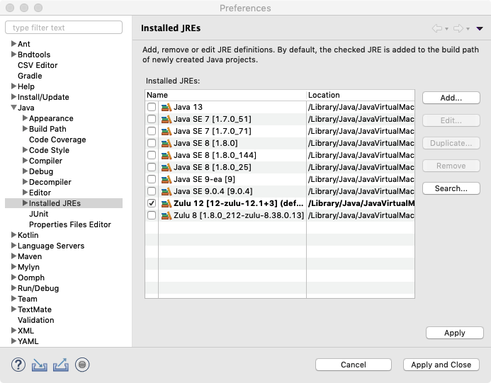

**Warning:** At the time of writing this document, Eclipse did not support Java 13 and 14 yet.

### Filters in the Bndtools Explorer

By default, Eclipse filters files that start with a dot (`.`). Since the dotfiles are often quite interesting to look at, it is best to disable this filtering. In the Bndtools Explorer, select the [little triangle or 3 dots in the top right of the view](https://help.eclipse.org/2019-12/index.jsp?topic=%2Forg.eclipse.platform.doc.user%2Ftasks%2Ftasks-48b.htm) to open the menu. Then select `Filters`. Just enable/disable the filters you want.

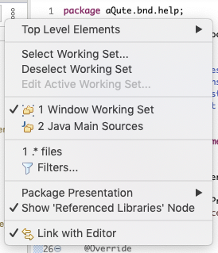

### Workspace Setup

The bnd tool uses the concept of a _workspace_. A workspace is a directory with a _configuration_ directory (`cnf`) and a directory for each _project_. (Not nested!). The bnd workspace can overlap with the Git workspace, the Gradle workspace, and the Eclipse workspace.

Bndtools has a _preference_ that lists workspace _templates_. In this tutorial, we’ll use a minimum template.

*   **Preferences** **›** **Bndtools** **›** **Workspace Template**
    

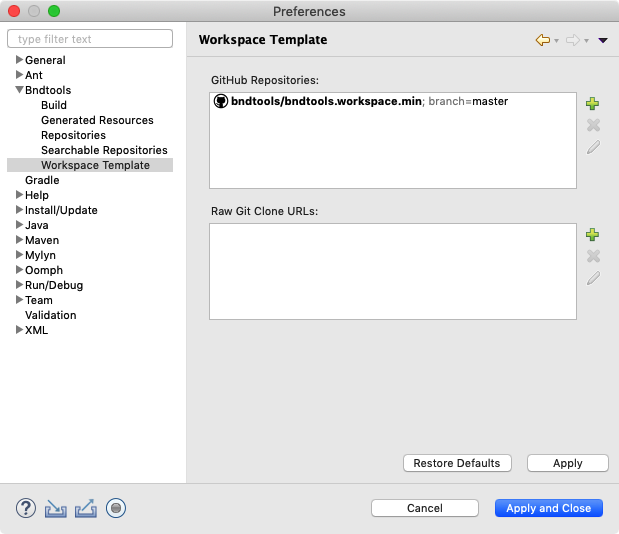

Ensure that the _template_ `bndtools/bndtools.workspace.min` is in this list for the `master` branch. Press the **Validate** button to verify that you entered this template’s address correctly. You can find the content of this workspace template here:

*   [https://github.com/bndtools/bndtools.workspace.min](https://github.com/bndtools/bndtools.workspace.min)
    

After installing the template, be sure to select the _Bndtools_ perspective:

*   **Window** **›** **Perspective** **›** **Open Perspective** **›** **Bndtools**
    

After you selected the Bndtools perspective, the explorer shows the cnf directory.

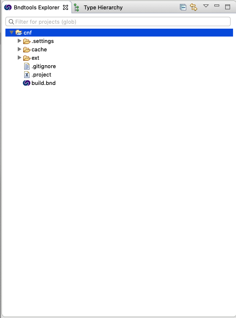

*   `.settings` – Eclipse settings like the compiler to be used, formatting rules, etc.
    
*   `cache` – Used by bnd to cache files, must be ignored by Git
    
*   `ext` – Extensions. Any properties file having an extension `.bnd` will be visible to all projects.
    
*   `.project` – Project setup for Eclipse, do not touch
    
*   `build.bnd` – A property file that contains the setup for this workspace. Anything defined in this file (or in a `bnd` file in the `ext` directory will be available to all projects.)
    

### New Project

Create a new project to verify the setup.

*   **File** **›** **New** **›** **Bndtools OSGi Project**
    

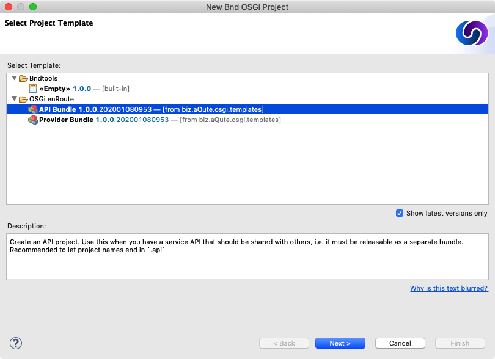

Projects can be created from _templates_. We are using the `[[empty]](#empty)` template that is part of Bndtools.

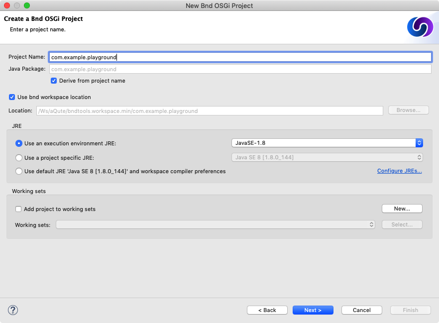

Enter the name of the project. Note that the name of the project is also the name of the bundle (a.k.a. the Bundle symbolic name). It is recommended, for this book, to use fully qualified names like `com.example.playground`.

Make sure the `JavaSE-1.8` execution environment is selected in the popup, then click **Next**.

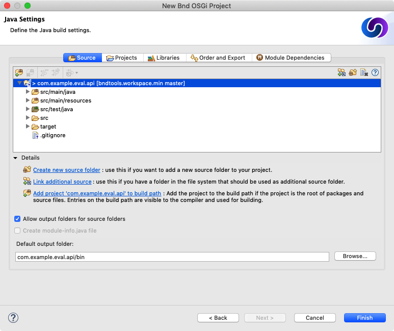

Note that the `Create module-info.java file` option must be disabled. If it is enabled, you’re using a >9 Java VM. In that case, make sure you know what you’re doing, it must then likely be disabled.

After you’ve clicked on **Finish**, you will see a new project.

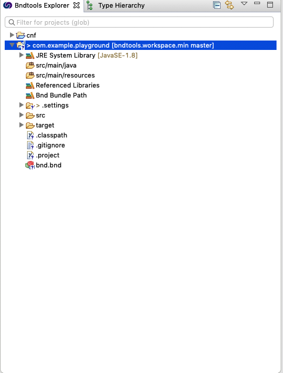

After the project is created, you can find the following files in it:

*   `JRE System Library` – Links Eclipse with the correct JDK
    
*   `src/main/java` – The source directory of the project. This is where the Java code goes
    
*   `src/main/resources` – The resource directory of the project. This is for bundle resources like images and other files
    
*   `Bnd Bundle Path` – Links Elipse to the bnd _buildpath_ defined in the `bnd` file. These are the source and test dependencies for this project
    
*   `.settings` – Eclipse settings like the compiler, formatting rules, etc.
    
*   `src` – Top-level src directory
    
*   `target` – Contains all generated files. This directory is not stored on Github
    
*   `.classpath` – Project setup for Eclipse. Do not touch
    
*   `.project` – Project setup for Eclipse. Do not touch
    
*   `bnd.bnd` – A property file that contains the setup for this project. It inherits from `cnf/build.bnd`
    
*   …​
    

### Running

To verify that the project is correctly set up, we’ll run the Gogo shell in an OSGi framework. To keep it simple, we’ll be running an OSGi _framework_ with the _Gogo_ shell as the only bundles.

*   Double click on the `bnd.bnd` file. This opens the _bnd editor_.
    
*   Select the **Run** tab
    
*   Enter `gogo` in the **Enter Search string** widget, this selects all bundles with `gogo` in their name
    
*   Drag the `com.example.playground`, `org.apache.felix.gogo.command`, and `org.apache.felix.gogo.shell` to the **Run Requirements** list
    
*   Press **Resolve**
    
*   Press **Update**
    
*   Save
    
*   Press **Debug OSGi**
    

This opens the shell in the Eclipse console. You can enter `lb -s` to see the bundles that are running in the framework.

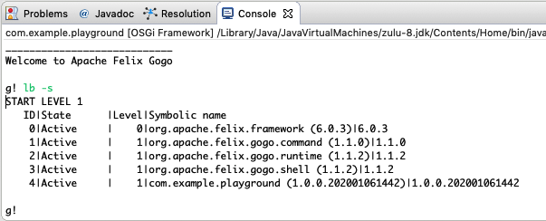

### Summary

We’ve installed Eclipse and then created an Eclipse workspace. The Eclipse workspace was then turned into a _bnd_ workspace from a Github template.

We then created a project as a playground for Gogo.

## Gogo

### TL;DR

This section explains how to use Gogo so that the remaining chapters can use Gogo to _explore_ the examples, making much of the book very interactive.

Gogo is much more powerful than most people think. As a minimum, you should try to run the Gogo shell in the playground project and try to understand commands like `help`, `echo`, `(bundle 0) headers`, and `s=bundle 1`.

### Gogo & Shells

The Gogo shell _feels_ like a bash shell that closely interacts with the OSGi framework. Gogo was designed to allow human users as well as programs to interact with an OSGi based system through a command-line based interface, also called a _shell_. This shell should allow interactive and string-based programmatic access to the core features of the framework as well as providing access to functionality that resides in bundles. However, I also wanted it to be a scripting language that would work with real Java objects.

Shells can be used from many different sources, for example, the built-in Eclipse console but sometimes also from an SSH client. It is, therefore, necessary to have a flexible scheme that allows bundles to provide shell fronts based on telnet, ssh, the Java Console class, plain Java console, serial ports, files, etc. Supporting commands from bundles was made to be very lightweight to promote supporting the shell from any bundle.

In this section, we explore the usage aspect of the Gogo shell.

### At Startup

When the Gogo shell starts, it prints out the following:

```
    ____________________________
    Welcome to Apache Felix Gogo
    g!
```

### Commands

The most simple command is `echo` which works as any developer should expect.

```
    g! echo Hello World
    Hello World
```

### Help

The `org.apache.felix.gogo.command` bundle provides a large number of commands. You can see those commands with the `help` function:

```
    g! help
    gogo:cat
    gogo:each
    gogo:echo
    gogo:format
    gogo:getopt
    gogo:gosh
    gogo:grep
    gogo:history
    gogo:not
    gogo:set
    gogo:sh
    gogo:source
    gogo:tac
    gogo:telnetd
    gogo:type
    gogo:until
    ...
```

The list shows the _scope_ (e.g. `gogo`) and the `function` name (e.g. `grep`).

The actual list is likely longer because many bundles provide additional commands.

You can get more information about a command with the `help` command by providing the name of the command:

```
    g! help echo
    echo
        scope: gogo
        parameters:
            Object[]
```

### History/Editing

In the Eclipse console, you can unfortunately not edit the commands. However, you can access the history.

```
    g! history
     1 echo Hello World
     2 help
     3 help echo
```

You can repeat a command using the bang (`'!'`):

```
    g! !1
    Hello World
    g! !ech
    Hello World
```

In standard terminals, you can use the cursor keys to move back and forth. Unfortunately, this not yet supported by Eclipse.

### Cheat Sheet

The following is a cheat sheet of the Gogo shell. You can ignore it for now but it might be a nice reference in the future.

```
    program    ::= executable ( '|' statements )*
    statements  ::= statement ( ';' statement )*
    statement   ::= assignment | expression
    assignment  ::= token '=' expression
    expression  ::= list | map | range | closure | command | variable | ne | '(' expression ')'
    command     ::= target | function
    target      ::= expression token ( ' ' expression)*
    function    ::= token ( ' ' expression)*
    list        ::= '[' expression ( ' ' expression )* ']'
    range       ::= '[' expression '..' expression ( '..' expression )? ']'
    map         ::= '[' assignment ( ' ' assignment )* ']'
    closure     ::= '{' program '}'
    ne          ::= '%(' <numeric expression> ')'
    variable    ::= '$' token
    token       ::= <complicated>
```

Special characters can be escaped by quoting them (double or single quotes) or prefixing them with a backslash (`'\'`). Numeric expressions support common Math functions.

Tokens are parsed more or less as a sequence of characters without whitespace or any of the special characters in `[](){};|&>`. A special rule applies to the curly brace token (`{`). If it is followed by whitespace it is a separate token, otherwise it is concatenated with the rest. (Don’t ask me why, I probably suffered from some obscure use case in my mind.)

### Quoting

Quoting (double or single) is optional if the word does not contain spaces or some special characters like '|', ';', and some others. So in this case two tokens are passed to echo. Notice that we can quote the two words turning it into a single token:

```
    g! echo Hello                     World
    Hello World
    g! echo 'Hello                     World'
    Hello                     World
```

### Multiple Commands

You can execute multiple commands on a line by separating the commands with a semicolon (`';'`).

```
    g! echo Hello; echo World
    Hello
    World
```

Multiple commands can also be separated by a _pipe_ character (`'|'`). In that case, the output is the input of the next command. Gogo has a built-in `grep` command so we can use `echo` to create output and `grep` to check the output.

```
    g! echo Hello | grep Hello
    Hello
    true
    g! echo Hello | grep World
    Hello
    false
```

### IO Redirection

Two built-in commands `cat` and `tac` ( tac = reversed `cat` because it writes instead of reads) are available to provide file data and store file data. Together with the pipe operator, they replace the input and output redirection of the bash shell.

```
    g! echo Hello | tac temp.txt
    Hello
    g! echo World | tac -a temp.txt
    World
    g! cat temp.txt
    Hello
    World
```

### Built-in Commands

Gogo’s commands are methods on _objects_. By default, Gogo adds all public methods of the `java.lang.System` class and the public methods on the session’s `BundleContext` as commands. Instead of directly using the method names, Gogo uses the _bean_ naming standard. That is, `getHeaders()` becomes `headers`.

This gives us access to some interesting System functions:

```
    g! currenttimemillis
    1458158111374
    g! property user.dir
    /Ws/enroute/osgi.enroute.examples/osgi.enroute.gogo.commands.provider
    g! nanotime
    1373044343558515
    g! identityhashcode abc
    828301628
    g! property foo FOO
    g! property foo
    FOO
    g! env JAVA_HOME
    /Library/Java/JavaVirtualMachines/jdk1.8.0_25.jdk/Contents/Home
    g! gc
    g!
```

### Errors

If Gogo cannot find a command, it will print a message like:

```
    g! hello
    gogo: CommandNotFoundException: Command not found: hello
```

This should be clear. However, sometimes it prints an Illegal Argument Exception:

```
    g! bundle 1 headers
    gogo: IllegalArgumentException:
        Cannot coerce bundle(Token, Token) to any of [
                (long),
                (),
                (String)
        ]
```

In this case, Gogo _did_ find a method with the given name (`bundle` in the previous example) but it could not match the parameters to the available methods. In the example, there are three methods available:

```
    (long)      => getBundle(long)
    ()          => getBundle()
    (String)    => getBundle(String)
```

However, it was called with `getBundle(Token,Token)` and therefore did not match any of the available methods.

### Variables

Variables can have any name. They are set with `<name>=<expr>`. They are referred to by `$<name>`. Gogo uses variables also itself. For example, the prompt can be changed by setting a new `prompt` variable.

```
    g! prompt= '$ '
    $
```

The following variables are in use by the shell:

*   `e` – A function to print the last exception’s stack trace
    
*   `exception` – The last exception
    
*   `prompt` – The shell prompt
    

You can also use the `${…​}` pattern in a token to access variables:

```
    g! name=World
    g! "Hello ${name}"
    Hello World
```

You can remove a variable by not providing a value:

```
    g! foo=1
    1
    g! $foo
    1
    g! foo=
    1
    g! $foo
    g!
```

### Objects

Notice that none of the System commands required anything special, they are just the methods defined on the System class. That implies that the implementation has no clue about Gogo. All these commands return domain, plain, unadorned objects. We can test this because Gogo has variables that store these plain objects. We can then use those objects in the shell as commands.

```
    g! nr = new java.lang.Integer 10
    10
    g! $nr doubleValue
    10.0
    g!
```

### Target

The syntax feels very natural but there is something a bit tricky going on. A command is executed on a _target_. A target is a Java object. However, Gogo searches for a match of the command name in several places.

### Literals

We’ve already used string literals. However, it is also possible to use lists and maps:

```
    g! [1 2 3] size
    3
    g! [a=1 b=2 c=3] get b
    \{ a=1, b=2, c=3 }
```

The type of the map is `LinkedHashMap`. Much of the original OSGi API takes a Dictionary. You can convert a literal map to a Dictionary as follows:

```
    g! new java.util.Hashtable [a=1 b=2 c=3]
    a                   1
    b                   2
    c                   3
```

### Expressions

So how do we access a specific header? A command like `$nr doubleValue intValue` cannot work because Gogo will see this as one command and will complain with: `Cannot coerce headers(String, String) to any of [()]`. The parentheses come to the rescue:

```
    g! nr = 10
    g! $nr doubleValue intValue
    gogo: IllegalArgumentException: Cannot coerce doublevalue(Token) to any of [()]
    g! ($nr doubleValue) intValue
    10
```

The parentheses first calculate the expression in their inner bowels, which then becomes available as the target object for the remaining command. For example, `($nr doubleValue)` returns a Double object, which subsequently becomes the target object. The `intValue` token is the name of the method called on this target object.

### Backticks

The bash shell has this wonderful capability of executing commands to get an argument by placing backticks around a command. We can use the parentheses for the same effect, with the added benefit that the parentheses work recursively.

```
    g! bundle = bundle 4
    g! echo Bundle ($bundle bundleid) has name ((bundle ($bundle bundleid)) symbolicname)
    Bundle 4 has name org.apache.felix.scr
```

### Functions

The Gogo shell can store commands for later execution. The `{` and `}` delimiters are reserved for that purpose. We can store these functions in objects or pass them as parameters. To execute a function as a command, you should use the name of the variable without the dollar (`'$'`) sign.

The `{` and `}` characters are not on the same parsing level as for example the `[` and `]`. You must separate them by spaces, otherwise, they are part of a larger token.

```
    g! f = \{ echo Hello }
    echo Hello
    g! f
    Hello
```

You can pass arguments to the function. They are named $1..$9. $0 is the command name if available. The $it macro refers to `$1`.

```
    g! f = \{ echo $it }
    echo $1
    g! f Hello World
    Hello
    g! f = \{ echo $1 }
    g! f Hello World
    Hello
```

Obviously, it is not very nice that we miss the `World` because we only used `$1`. There is a _magic_ variable called `$args`. This variable is list that gets expanded into separate arguments. So we can change our function to use all the arguments when the function is invoked:

```
    g! f = \{ echo $args }
    echo $args
    g! f Hello         World
    Hello World
```

The `$args` list of arguments cannot be manipulated as a normal object as it gets expanded into its members wherever you use it.

```
    g! prompt={ }
```

You can store several functions together in a file and `source` them:

```
    g! source utils.gogo
    ...
```

### Repeat and Conditionals

Gogo provides some built-in commands that use the functions to provide conditional and repeated execution. For example, the `each` command takes a collection and a function. It then iterates over the collection and calls the function with the element of the iteration.

```
    g! each [1 2 3] \{ echo -- $it --  }
    -- 1 --
    -- 2 --
    -- 3 --
    null
    null
    null
```

We can now also use the `if` command:

```
    g! l = []
    g! if \{ $l isempty } \{ echo empty } \{ echo not empty }
    empty
    g! $l add foo
    g! if \{ $l isempty } \{ echo empty } \{ echo not empty }
    not empty
```

You can negate with the `not` command, which takes a function:

```
    g! if { not {$l isempty}} { echo not empty } { echo empty }
    not empty
```

### New

You can use the `new` command to create new objects. The `new` command takes the name of a class and then the parameters for the constructor.

```
    g! object = new java.lang.Object
```

### Numeric Expressions

The Gogo shell has a convenient calculator for simple expressions built-in. The calculator is invoked for an expression that is enclosed by a `%(` and `)`. For example:

```
    g! echo %(21*2)
    42
```

Numeric expressions allow you to evaluate simple mathematical and boolean expressions. It is as far as I know completely undocumented, the parsing is flaky, and it is completely unconnected to the Gogo shell. That is, you cannot even use the variables in the Gogo shell inside an expression However, sometimes it can be a lifesaver.

### Exceptions

You (and any code you call) can throw exceptions. The last exception is stored in the `$exception` variable and there is a built-in function `e` that shows the stack trace.

```
    g! throw (new java.lang.Exception Foo)
    ...
    g! $exception message
    Foo
    g! e
    java.lang.Exception: Foo
    at org.apache.felix.gogo.shell.Procedural._throw(Procedural.java:83)
    ...
```

You can also catch the exceptions with a `try` command.

```
    g! exception = null
    g! try { throw (new java.lang.Exception Foo) }
    g! $exception
    g!
```

Of course we now silently ignore the exception, which is not a good idea. So we can provide a catch function that receives the exception as the \\$it variable.

```
    g! try { throw (new java.lang.Exception Foo) } { echo ouch }
    ouch
    g!
```

### Telnet Daemon

The Eclipse console is not very user-friendly for editing the command line. You can start a telnet daemon.

```
    g! telnetd
    telnetd - start simple telnet server
      Usage: telnetd [-i ip] [-p port] start | stop | status
      -i --ip=INTERFACE        listen interface (default=127.0.0.1)
      -p --port=PORT           listen port (default=2019)
      -? --help                show help
```

### Summary

In this chapter, you’ve learned the basics of the Gogo shell. You may wonder why so much effort is spent on learning a simple shell? Well, Gogo should be seen as the fabric of your application. We will see later that it is incredibly easy to provide first-class, well-documented commands in Gogo for every service. Having this fabric is very useful in learning and testing services.

And it is fun …​

## A New Gogo Command

### TL;DR

Adding a new Gogo command is very easy and provides a very gentle introduction to programming in OSGi. In this chapter, we will create a _component_ that registers a Gogo command that prints 'Hello World'. This component is then further enhanced to use parameters and provide helpful information.

You can follow a short video at [bndtools.org](https://bndtools.org/workspace.html#hello-world-gogo-command).

### Prerequisites

This chapter assumes you have the `com.example.playground` project in your workspace and it is running the playground with the Gogo shell as was explained in the [Starting with OSGi](#starting_with_osgi).

In Bndtools, everything is built and deployed all the time, after every save. Sometimes you save and this creates errors in the running framework. In this case, you can just correct the error and continue. In general, this will correct the error.

Only when you’re lost, you should restart the framework.

### Creating a Project

You can create a new project with **File** **›** **Bnd OSGi Project**. The project will be called `com.example.playground` here, but you can pick your own name.

To create a component, the easiest way is to use a little `C` icon at the top of the window:

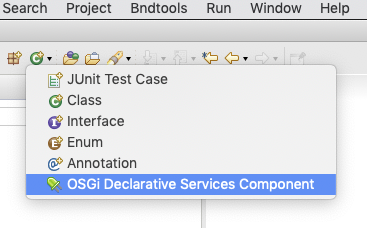

The `OSGi Declarative Services Component` entry opens a window for a component.

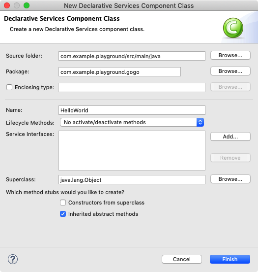

Make sure to fill in the `Package` and `Name` fields.

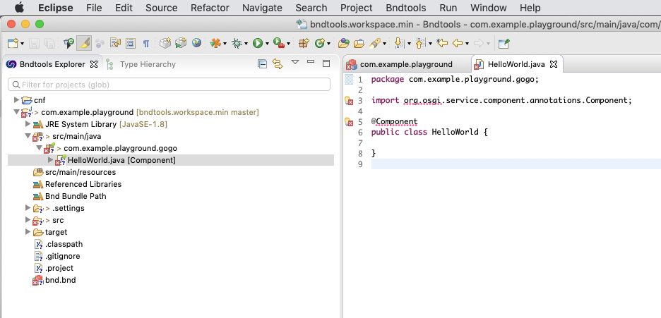

The source contains errors because we have not yet added any dependencies. Since the source uses the OSGi component annotations, the compiler cannot compile the source code. You can use the quick fix (The little yellow light bulb with the red cross) to add the OSGi annotations as a dependency.

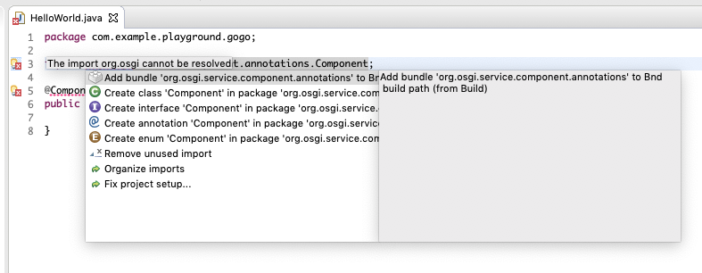

The source now compiles and looks like:

```java
    package com.example.playground.gogo;
    import org.osgi.service.component.annotations.Component;

    @Component
    public class HelloWorld {}
```

Bundles add commands to the shell by registering a _service_ with the `osgi.command.scope` and `osgi.command.function` service properties. The Gogo shell detects these service properties and will register any method whose name is listed in the `osgi.command.function` service property. Since services could choose the same command name, the `osgi.command.scope` service property can be used to disambiguate the command on the command-line. Just prefix a command with the scope and a ':' before the function name (no spaces).

```
    g! scope:name
    ...
```

If a component does not implement an interface then it will **not** be registered as a _service_. Since Gogo is looking for services with the previously defined properties to register commands, it would not be able to find this "Hello World" command. Since this "Hello World" component does not implement anything, we need to make the service _explicit_. We use `Hello` class as the service type in the `service()` annotation method on the `@Component` annotation.

```java
    @Component(
        property = {
            "osgi.command.scope=hello",
            "osgi.command.function=hello"
        },
        service=Hello.class
    )
    public class Hello {
        public void hello() {
            System.out.println("Hello World");
        }
    }
```

### Running the Hello World Command

Select the `bnd.bnd` file, and then the **Run** tab. You can drag the Gogo command, the Gogo shell bundles, as well as the `com.example.playground` bundle into the `Run Requirements` list.

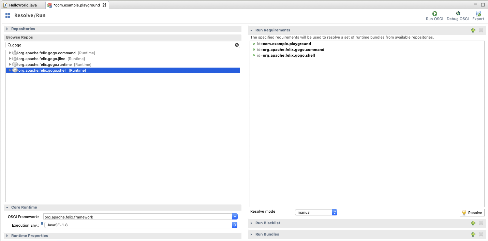

Then click on **Resolve**.

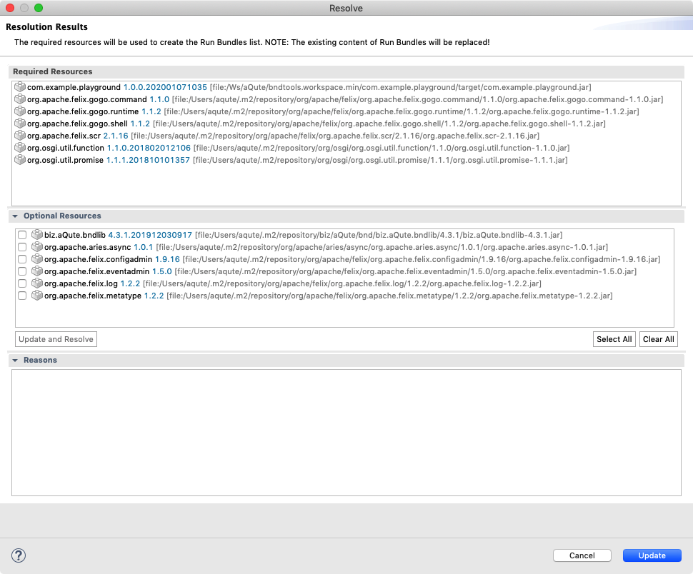

After you successfully resolved this, click the **Update** button. Last, save the file and click on **Debug OSGi**. This should start the Gogo shell in the Console view.

### Using the Shell

In the shell, we can now call the function:

```
    g! hello World
    Hello World
```

In actual systems, the number of Gogo commands tend to get very large. The number of commands makes it hard to ensure each command has a unique name. This is the reason we had to specify the `osgi.command.scope` service property so commands could be disambiguated on the command line. We can now uniquely identify a command if the combination of the scope and the function name is unique.

```
    g! hello:hello World
    Hello World
```

### System.out

In the example, we use `System.out`. This is ok, even if the shell is accessed via SSH or telnet. The Gogo shell redirects `System.out` for the duration of a command. However, using `System.out` makes the command only useful in a shell and the function can not really be called from other services. One of the primary goals of Gogo is to make commands very lightweight. The idea is that normal service implementations can provide commands reusing existing functions. Therefore, we can also just return the String, Gogo will then print the text.

```java
    public String hello() {
        return "Hello World";
    }
```

After you’ve made this change and saved the source, we can try it in the shell immediately; there is no need to restart the framework. Bndtools will automatically update any changed bundles. (Not restarting the framework is sometimes hard to unlearn.)

```
    g! hello
    Hello World
```

### Arguments

Commands can also take parameters by declaring them in the prototype. For example, we can provide a name that is welcomed.

```java
    public String hello(String name) {
        return "Hello " + name;
    }
```

```
    g! hello peter
    Hello peter
```

Parameters can use any type they want. Gogo will attempt to coerce the given command to the proper types. For example, we could add a `boolean` argument to upper case the result:

```java
    public int hello(boolean uppercase, String name) {
        String msg = "Hello " + name;
        return uppercase ? msg.toUpperCase() : msg;
    }
```

```
    g! hello true peter
    HELLO PETER
```

### Flags

Linux shell commands have a convention to provide _flags_. Specifying, for example, `-a` for the `ls` command lists _all_ files, including the `.` and `..` files. You can mark a parameter with the `@Parameter` annotation to provide a flag.

```java
    public String hello(
        @Parameter(
                names={"-u", "--uppercase"},
                absentValue="false",
                presentValue="true")
        boolean uppercase,
        String name) {
        String msg = "Hello " + name;
        return uppercase ? msg.toUpperCase() : msg;
    }
```

The previous code will not compile because we’re missing the bundle that provides the `@Parameter` annotation. You can add the following import line and then use the Quick Fix to add the `org.apache.felix.gogo.runtime` bundle to the _build path_.

```java
    import org.apache.felix.service.command.annotations.Parameter;
```

The `names` annotation field specifies an array of names that _name_ the flag. In this case, we support the common short form of a flag (`-u`) and the long-form (`--uppercase`). The `absentValue` annotation method defines what value is assigned to the parameter `uppercase` when none of the names are used in the command. The `presentValue` specifies the value to use when one of the names is used in the command. The annotation fields are strings but Gogo will convert them to the field’s type. In this example, the `absentValue` is `"false"` but will be converted to the boolean `false`.

Since the `uppercase` is now a flag, we do not need to specify a boolean anymore. And since it is a flag, even the `-u` or `--uppercase` identifier is optional, if this identifier is absent Gogo will use `false`.

So let’s try it out:

```
    g! hello peter
    Hello Peter
    g! hello -u peter
    HELLO PETER
```

Notice that annotated parameters, like `uppercase`, must come _before_ any unannotated parameters.

### Optional Parameters

An _option_ is a _named_ parameter. Using the `@Parameter` annotation, we can turn a parameter in an option by specifying a set of _names_ and a value when these names are absent. The `absentValue` annotation method can provide this value. There is no need to set the `presentValue` annotation method because we use the actual value given on the command line.

```java
    public String hello(
        @Parameter(
            absentValue="World",
            names={"-n","--name"})
            String name
        ) {
        return "Hello " + name;
    }
```

Since we have an `absentValue`, we do not need the value to be specified on the command line. So we can call the command with and without a parameter.

```
    g! hello
    Hello World
    g! hello -n OSGi
    Hello OSGi
    g! hello --name OSGi
    Hello OSGi
```

### Adding Help

Gogo provides a `help` command that works out of the box:

```
    g! help
    gogo:type
    gogo:until
    hello:hello
    scr:config
    ...
    scr:disable
    g! help hello
    hello
        scope: hello
```

We can add a `@Descriptor` annotations to the component to assist the help function. If you import:

```java
    import org.apache.felix.service.command.Descriptor;
```

And add the annotation to the method:

```java
    @Descriptor("Friendly welcome")
    public String hello() {
        return "Hello World";
    }
```

Then the output of the help command has changed:

```
    g! help hello
    hello - Friendly welcome
        scope: hello
```

You can also apply the `@Descriptor` annotation on the parameters.

```java
    @Descriptor("Friendly welcome command")
    public String hello(
        @Parameter(
            absentValue="World",
            names={"-n","--name"})
            @Descriptor("Name to welcome")
            String name
        ) {
        return "Hello " + name;
    }
```

```
    g! help hello
    hello - Friendly welcome command
    scope: hello
    options:
        -n, --name   Name to welcome [optional]
```

### Property Annotation

The component properties `osgi.command.scope` and `osgi.command.function` are constructed from strings. This is an error-prone programming pattern. We used this error-prone patter to make more clear what was going on beneath the covers; it also allowed us to get started without importing the Gogo runtime bundle. However, the `org.apache.felix.runtime` bundle, that we use for the `@Descriptor` and `@Parameter` annotations, also contains an annotation to add service properties: `@GogoCommand`. This annotation cleans up the component by defining the Gogo service properties via a simple annotation.

```java
    @GogoCommand(scope="hello", function="hello")
    @Component(service=Object.class)
    public class HelloWorld { ... }
```

### Summary

In this chapter, we created a Gogo command with the OSGi Declarative Services standard. We used the playground project to interactively change the initial simple command into a fully documented command with a flag and parameters.

## API Bundle

### TL;DR

OSGi’s primary innovation is the _service registry_. Services are used to decouple components/modules from each other. In OSGi, modules depend on service _contracts/APIs_, not on other modules as is the custom in classical module systems. Services require a _contract_ or _API_. An OSGi API is a bit like a screenplay for a movie, it describes how the different _actors_ (the service implementations) must play their _role_ (the service interfaces). A contract is represented by an _exported_ package in OSGi that holds the classes, interfaces, and documentation.

In this section, we are going to create an API for a simple expression evaluator. It will teach you how to create an API project, how to name a project, and how to navigate around inside the project. We will also explain how to export and version the API package.

You can follow a short video at [API & Provider Project](https://bndtools.org/workspace.html#api—​provider-project).

### Creating an API Project

Assume, we noticed that in several projects developers evaluated expressions from a string like `5*2`. They used different libraries, had different syntaxes, and they had different ways of adding custom functions. To address these issues, we created a story that there should be a service that could evaluate these types of expressions.

So let’s create an API project.

*   Create a project with **File** **›** **New** **›** **Bnd OSGi Project**. Name the project:
    

```
    com.example.eval.api
```

*   Use the `API` template.
    
*   This template will ask for the name of the service interface. Use `Eval` for this exercise.
    
*   Uncheck the 'Create module-info.java file' option if it is enabled. (This happens on Java 9 and later; it is recommended to use Java 8.)
    
*   **Finish**
    
*   Update the given `Eval` interface in the package `com.example.eval.api` to:
    

```java
    package com.example.eval.api;
    public interface Eval {
        double eval(String expression) throws Exception;
    }
```

### Naming

The name of this API project was not chosen at random. Over the years, a common pattern was established as a best practice to name projects.

`<domain>.<workspace>.<api>\[.<provider>\].<ext>`

<table class="tableblock frame-all grid-all stretch">
    <colgroup>
    <col style="width: 33.3333%;" />
    <col style="width: 33.3333%;" />
    <col style="width: 33.3334%;" />
    </colgroup>
    <thead>
    <tr>
        <th class="tableblock halign-left valign-top">Part</th>
        <th class="tableblock halign-left valign-top">Example</th>
        <th class="tableblock halign-left valign-top">Description</th>
    </tr>
    </thead>
    <tbody>
    <tr>
        <td class="tableblock halign-left valign-top">
        <p class="tableblock">domain</p>
        </td>
        <td class="tableblock halign-left valign-top">
        <p class="tableblock"><code>com.example</code></p>
        </td>
        <td class="tableblock halign-left valign-top">
        <p class="tableblock">
            The organization&#8217;s domain name as is common in Java
        </p>
        </td>
    </tr>
    <tr>
        <td class="tableblock halign-left valign-top">
        <p class="tableblock">workspace</p>
        </td>
        <td class="tableblock halign-left valign-top">
        <p class="tableblock"><code>prime</code></p>
        </td>
        <td class="tableblock halign-left valign-top">
        <p class="tableblock">
            A unique name in the organization for the workspace/system
        </p>
        </td>
    </tr>
    <tr>
        <td class="tableblock halign-left valign-top">
        <p class="tableblock">api</p>
        </td>
        <td class="tableblock halign-left valign-top">
        <p class="tableblock"><code>eval</code></p>
        </td>
        <td class="tableblock halign-left valign-top">
        <p class="tableblock">The API name</p>
        </td>
    </tr>
    <tr>
        <td class="tableblock halign-left valign-top">
        <p class="tableblock">provider</p>
        </td>
        <td class="tableblock halign-left valign-top">
        <p class="tableblock"><code>simple</code></p>
        </td>
        <td class="tableblock halign-left valign-top">
        <p class="tableblock">
            A short name of the typical implementation aspect of the
            API
        </p>
        </td>
    </tr>
    <tr>
        <td class="tableblock halign-left valign-top">
        <p class="tableblock">ext</p>
        </td>
        <td class="tableblock halign-left valign-top">
        <p class="tableblock"><code>api</code></p>
        </td>
        <td class="tableblock halign-left valign-top">
        <p class="tableblock">
            One of the common extensions like <code>api</code>,
            <code>provider</code>, etc.
        </p>
        </td>
    </tr>
    </tbody>
</table>

The advantage of this naming scheme is that it sorts rather well. In a sorted list it puts related projects close together.

### Building

Bndtools will _immediately_ build the bundle directly after any change is saved, hence there is never a need to worry if projects have already been built. Any dependencies are also always rebuilt automatically.

Therefore, in the `target` directory of the `com.example.eval.api` project you can now find the bundle for this project. You can double click on this `JAR` file which will open a window with its contents. This window selects the _manifest_ of the bundle. The manifest contains metadata for OSGi:

```
    Manifest-Version: 1.0
    Bnd-LastModified: 1578407040731
    Bundle-ManifestVersion: 2
    Bundle-Name: com.example.eval.api
    Bundle-SymbolicName: com.example.eval.api
    Bundle-Version: 1.0.0.202001071424
    Created-By: 1.8.0_144 (Oracle Corporation)
    Export-Package: com.example.eval.api;version="1.0.0"
    Require-Capability: osgi.ee;filter:="(&(osgi.ee=JavaSE)(version=1.8))"
    Tool: Bnd-5.0.0.201912100922-SNAPSHOT
```

### Service API Package

Although a service is registered with a single interface, we should define a service in a separate _package_. The reason is that in anything but the most trivial services you will need support objects and multiple collaborating service interfaces. A service API is like the scenario for a role play, you have different actors (interfaces) and stage props (objects).

Therefore when we talk about a service API, we always refer to a package, although every single service is implemented in a single interface.

### Exporting

The `com.example.eval.api` package is _exported_ in the manifest, looking at the `Export-Package` header. An exported package can be used by other bundles that _import_ it. This project was created from the API template. It automatically exports the package with the API.

You can export a _package_ by adding an annotation to the `package-info.java` file in that package. This is already prepared for you by the template project.

```java
    @org.osgi.annotation.versioning.Version("1.0.0")
    @org.osgi.annotation.bundle.Export
    package com.example.eval.api;
```

You can also see that a package is exported in the Eclipse Explorer. An exported package in the explorer is exported when it is decorated with a little green `+` icon in the left top.

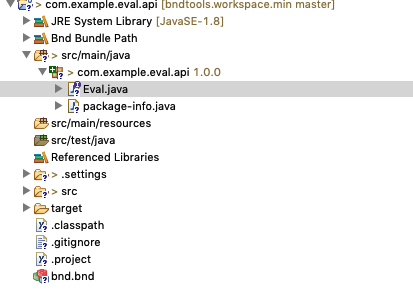

### Versioning

In OSGi, a service package must be exported so that other bundles can rely on being linked to a _compatible_ service. The purpose of versioning is to ensure that bundles that are compiled against an API are compatible with the providers of that API. Semantic versions provide the information for OSGi (and bnd) to ensure the validity of the system.

For this reason, an OSGi version has 3 parts:

major.minor.micro.qualifier

*   `major` – A change in this part signals full incompatibility,
    
*   `minor` – A change in this part indicates that _consumers_ are ok but _providers_ are incompatible,
    
*   `micro` – A compatible change.
    

Here, the API package is versioned with a version of `1.0.0` with the `@org.osgi.annotation.versioning.Version("1.0.0")` annotation.

#### Showing Off!

If you change the `@org.osgi.annotation.versioning.Version("1.0.0")` in the `package-info.java` file to version `1.2.3` and then look at the manifest by clicking on the `target/com.example.eval.api.jar` file. You will see that the `Export-Package` header is immediately updated.

If you remove the `@org.osgi.annotation.bundle.Export` in `package-info.java` then the `+` icon is removed from the package and the manifest will show:

Private-Package: com.example.eval.api;version="1.2.3"

Having an `@Version` annotation on a non-exported package is of course not recommended. Private packages should not have versions.

### Provider Type

The Eval source also shows a `@ProviderType` annotation. When your dependency model is based on contracts it turns out that you have two different kinds of dependencies on contracts. The provider is the bundle that is primarily responsible for the contract and the consumer is the one depends on the contract to provide it some utility. The annotations `@ProviderType` and `@ConsumerType` mark an interface’s expected implementor: either the provider or the consumer. The words _consumer_ and _provider_ are used because both a provider as well as a consumer can be an _implementer_ or a _user_ of a service interface.

Confused? Experience shows this is a difficult topic. In general, bnd will do the right thing.

### Summary

We’ve now created an API project that exports a package with one interface. The project has no dependencies.

In the next chapter, we’ll create a simple _provider_ of the `com.example.eval.api` API. :experimental: true :icons: font

## Provider Bundle

### TL;DR

In this section, we create a _provider_ for the Eval API. We will show how to add dependencies to a project and explain the `-buildpath`.

You can follow a short video at [Provider Project](https://bndtools.org/workspace.html#api—​provider-project). You may also check out [External Dependencies](https://bndtools.org/workspace.html#external-dependencies).

### Providing an API

In the previous section, we created an _API_ project for a simple _expression evaluator_. In this chapter, we create another project that provides an implementation for the Eval API. A bundle that has as its sole reason to provide an API is called to be a _provider_ bundle. Any service contract can have many different providers although in general only one is selected for the runtime. For example, there are providers for the OSGi `org.osgi.service.event` API from Eclipse, Apache Felix, and Knopflerfish. You can _compile_ against the OSGi API and then select one of the providers in your runtime.

### Create a Provider Project

Create a project called `com.example.eval.simple.provider`. The `simple` part of the name allows us the freedom to have alternative providers of the `com.example.eval.api` service API. For example, we will later add a provider that uses a popular expression library from Maven Central.

Using the `Provider Bundle` template, you will be asked for the name for a component. Use `EvalImpl` for this name.

### Create a Component

The template has already provided a component for you. The EvalImpl class should give the following source code:

```java
    package com.example.eval.provider;
    import org.osgi.service.component.annotations.Component;

    @Component
    public class EvalImpl {    }
```

### Dependencies

The next step is to implement the `Eval` interface from our API project. It is time anyway to dive deeper into how bnd handles the _build path_.

To compile the code, the compiler needs to have a _build path_, a set of bundles that provide the APIs to compile against. This build path is defined in the `bnd.bnd` file in every project.

If you open this `bnd.bnd` file and select the **Source** tab you see it is currently empty.

### Repositories

The _workspace_ has several _repositories_, repositories are a collection of bundles. If you look at the bottom-left of the screen (in the Bndtools perspective) you can see the current repositories of the workspace.

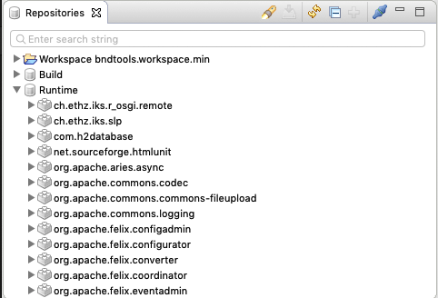

In the current workspace there are three repositories configured:

*   Workspace – Contains all the bundles from the projects
    
*   Build – Bundles intended to be used in the build only. E.g. API, test, etc.
    
*   Runtime – Bundles for the runtime
    

The repositories are defined in the `cnf` project, look in the `ext` directory for their definition files. We will not discuss the details here. However, bnd has an extremely flexible repository model and supports out of the box Maven repositories, P2 repositories /target platforms, and OSGi XML repositories.

### Build Path

The build path dependencies of a bnd project are defined in the `bnd.bnd` file. We can, therefore, control the build path through the _build path editor_. Double click on the `bnd.bnd` file and select the **Build** tab.

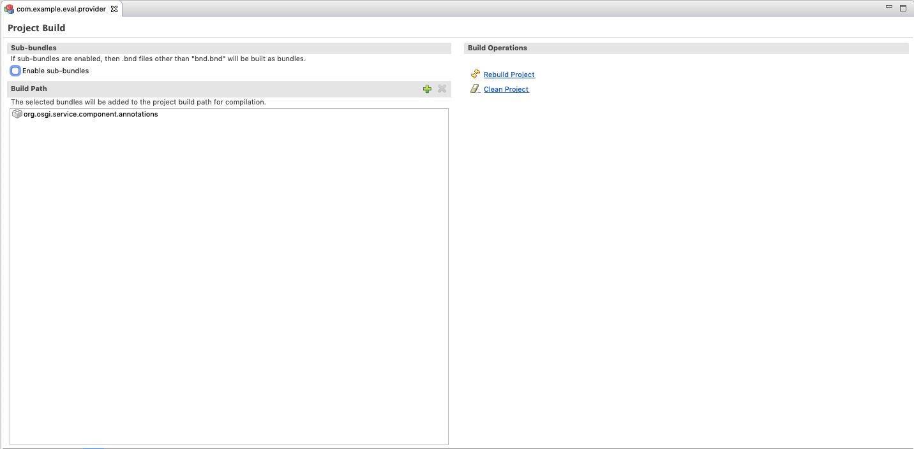

As you can see, the `org.osgi.component.annotations` bundle is already listed. To add another dependency, click on the **+** and then _swipe_ the `com.example.eval.api` bundle from the left to the right (or click the **Add** if you’re not into swiping). If you’re looking for a specific bundle then you can filter them by symbolic name. Type the name in the filter text box to limit the entries that match.

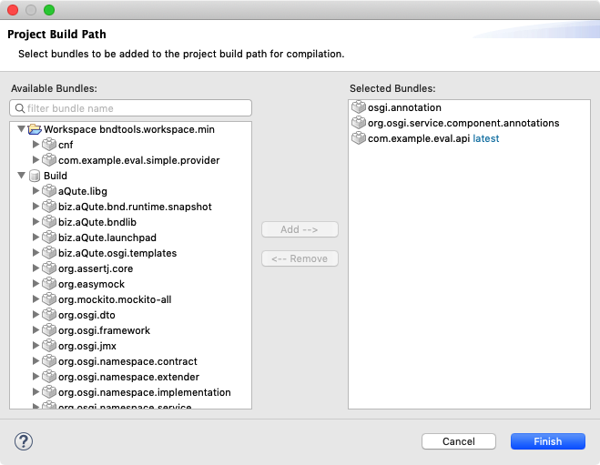

Press **Finish** and save the `bnd.bnd` file because otherwise there is no effect.

When you save this file, Eclipse will add all bundles on the build path to its internal _compiler path_. If you look in the Bndtools Explorer, open the project, then you should see an item called `Bnd Bundle Path`. You can open this entry and beneath it, you will see all build path entries. Each entry is also possible to open, it allows you to inspect the classes that are contributed to the compiler.

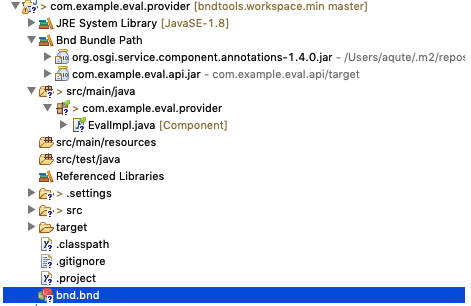

### Implementing Eval

You can now go back to the `EvalImpl` class and implement the `Eval` interface.

```java
    @Component
    public class EvalImpl implements Eval {}
```

Just select the `Eval` name (which is red underlined) and click `Control-1`, select `Import 'Eval' (com.example.eval.api)`. This will take care of the import. Don’t forget to save it!

Alas, we got rid of the import error but in place of this error, we now get a red underlined `EvalImpl` class. The problem is that we need to provide the `eval` method, as prescribed by the Eval interface that it now implements. Let’s keep it as simple as possible while still doing something not utterly useless:

```java
    @Component
    public class EvalImpl implements Eval {
        Pattern EXPR = Pattern.compile( "\\s*(?<left>\\d+)\\s*(?<op>\\+|-)\\s*(?<right>\\d+)\\s*");
        @Override
        public double eval(String expression) throws Exception {
            Matcher m = EXPR.matcher(expression);
            if ( !m.matches())
                return Double.NaN;
            double left = Double.valueOf( m.group("left"));
            double right = Double.valueOf( m.group("right"));
            switch( m.group("op")) {
              case "+": return left + right;
              case "-": return left - right;
            }
            return Double.NaN;
        }
    }
```

Ok, ok, calling it simple might still give it too much credit but we’re not here to learn parsing. At least it has (some) error handling! Notice that we can only handle trivial additions and subtractions of constants.

### Imports

It is about time now to take a look at what our bundle really looks like. Double click on the `target/com.example.eval.simple.provider.jar` file. This opens the _JAR Editor_. Select the **Print** tab, look at the `IMPEXP` section.

```
    [IMPEXP]
    Import-Package
    com.example.eval.api                   {version=[1.0,1.1)}
```

The reason we import the minor range (`[1.0,1.1)`) is that the `Eval` interface was annotated with the `@ProviderType` and we do implement this interface. Because we implement a provider interface, bnd assumes this bundle is a _provider_ of the `com.example.eval.api` API and therefore must import the package with a minor range. If the contract changes in any way, we need to make a new version of this provider bundle.

**Note:** The concepts of provider and consumer of APIs seem hard to understand. Fortunately, bnd handles it all quite well. Trust us. :-)

### Gogo Command

Making a service a Gogo command is a good way to _play_ with the services that are being developed.

Add `org.apache.felix.gogo.runtime` to the `-buildpath` in the `bnd.bnd` file.

```
    -buildpath: \
        osgi.annotation,\
        org.osgi.service.component.annotations,\
        com.example.eval.api;version=latest,\
        org.apache.felix.gogo.runtime

    -testpath: \
        osgi.enroute.junit.wrapper, \
        osgi.enroute.hamcrest.wrapper
```

Then add the `@GogoCommand` annotation to the `EvalImpl` class.

```java
    @GogoCommand(scope="simple", function={"eval"})
    @Component
    public class EvalImpl implements Eval {...}
```

### Running in the Playground

Open the `bnd.bnd` file of the `com.example.playground` project we created in the starting section. Select the **Run** tab. In this tab you can add the `com.example.eval.simple.provider` bundle to the initial requirements. You should then **Resolve**. The calculated list of bundles should look something like:

```
        org.apache.felix.gogo.command
        org.apache.felix.gogo.runtime
        org.apache.felix.gogo.shell
        com.example.playground
        org.apache.felix.scr
        org.osgi.util.function
        org.osgi.util.promise
        com.example.eval.api
        com.example.eval.simple.provider
```

The _resolver_ that we used is the secret weapon of OSGi. It searches the repositories, including our own code, for bundles that can work together. Each bundle contains _metadata_ that describes what requirements it has to the outside world and what capabilities it can provide. In the end, the resolver creates a set of bundles where all their requirements are satisfied. Or it gives up …​

Notice how the resolver automatically added the `com.example.eval.api` bundle. It noticed that this was required by the `com.example.eval.simple.provider` bundle.

You should **Finish** the resolver and save the `bnd.bnd` file.

If the framework was still running, the new bundles will automatically be added. We should then immediately be able to run the command:

```
    g! eval 1+2
    3.0
```

### Summary

In this section, we created a provider for the `com.example.eval.api` API. We used the Provider template to create an EvalImpl component. We extended the build path to contain the API project and wrote a simplistic implementation.

We then tested the implementation with a Gogo command in the playground.

## JUnit Testing

### TL;DR

In this section, we will create a _whitebox_ JUnit test for our provider implementation. This test will not depend on OSGi. It is a goal in OSGi projects to make the components testable without the overhead of an OSGi framework. These JUnit tests are very cheap; using them extensively saves a tremendous amount of time in later phases of the development process. JUnit tests are always run before code is released and when they fail, they prohibit the release of the project.

JUnit tests can also contain _launchpad_, a bnd library to test with an OSGi framework present.

Testing is one of those chores a developer has to do, not as much fun as some deep algorithmic code. However, it is likely one of the most effective ways to spend your time.

This section is not needed if you’re familiar with JUnit and launchpad.

### JUnit

A provider should always have **unit** tests. Unit tests are **white** box tests. The test knows about the implementation details and it can even see aspects of the components that are not part of the public API.

The `Provider Bundle` template provided us with a template for the test class: `EvalImplTest` in the `test` folder. This class is set up to run a JUnit 4 test:

```java
    package com.example.eval.simple.provider;

    import static org.junit.Assert.assertNotNull;
    import org.junit.Test;
    import com.example.eval.simple.provider.EvalImpl;

    public class EvalImplTest {
        @Test
        public void simple() {
            EvalImpl impl = new EvalImpl();
            assertNotNull(impl);
        }
    }
```

The `test` folder is special. No code from the `test` folder should not end up in our bundle, nor should any of its dependencies be counted as imports. For this reason, the `test` folder is compiled with the `-buildpath` and the, `-testpath`. bnd guarantees that no test code, nor any of its dependencies in the `-testpath`, can accidentally end up in the bundle.

The template has already set up the `-testpath` with the JUnit dependencies. You can click on the `bnd.bnd` in the `com.example.eval.simple.provider` project, select the **Source** tab:

```
    #
    # com.example.eval.simple.provider PROVIDER BUNDLE
    #

    -buildpath: \
        osgi.annotation,\
        org.osgi.service.component.annotations,\
        com.example.eval.api;version=latest


    -testpath: \
        osgi.enroute.junit.wrapper, \
        osgi.enroute.hamcrest.wrapper
```

So let’s evaluate a simple expression:

```java
    package com.acme.prime.eval.provider;
    import static org.junit.Assert.assertEquals;

    public class EvalImplTest {
        @Test
        public void testSimple() throws Exception {
            EvalImpl t = new EvalImpl();
            assertEquals( 3.0,  t.eval("1 + 2"), 0.0001D);
        }
    }
```

You can run the test by selecting the class name (`EvalImplTest`) or the method name (testSimple), call up the context menu, and select **RunAs** **›** **JUnit Test**. Do not select **RunAs** **›** **Bnd OSGi Test Launcher (JUnit)**

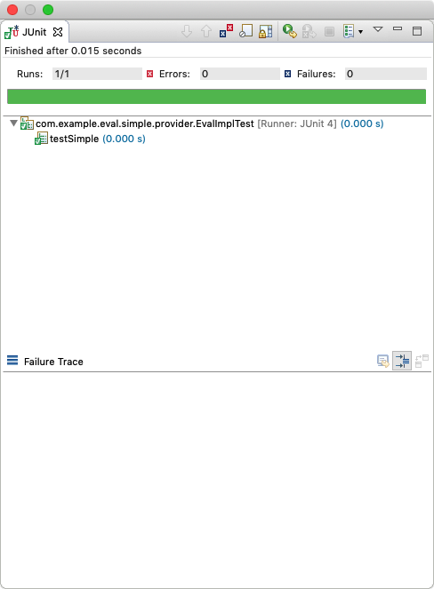

To run JUnit tests you can select the project in the explorer, the `test` folder, a package, a class, or a method and call up the context menu and then **RunAs** **›** **JUnit Test**. It will then run all tests selected beneath that level.

### Debugging

Since most code does not run the first time, we need to debug as well. You can set a breakpoint by double-clicking in the margin where you want the breakpoint to happen. A blue dot then appears. Just select the test method you want to run and do **Debug As** **›** **JUnit Test**.

The JUnit pane has many buttons that allow you to rerun tests, an incredibly powerful tool.

### Launchpad

Launchpad is bnd library that makes it easy to test OSGi code in a normal plain JUnit environment. To use Launchpad, make sure to add the following entries to your `-testpath` in the bnd.bnd file:

```
    -testpath:  \
        biz.aQute.launchpad,\
        org.osgi.framework,\
        slf4j.api,\
        slf4j.simple,\
        org.osgi.resource,\
        org.osgi.dto,\
        org.osgi.util.tracker,\
        com.example.eval.api, \
        osgi.enroute.junit.wrapper, \
        osgi.enroute.hamcrest.wrapper
```

Also add the following runbundles:

```
    -runbundles: \
        com.example.eval.api;version=snapshot,\
        org.apache.felix.scr,\
        org.osgi.util.function,\
        org.osgi.util.promise,\
        org.apache.felix.gogo.command,\
        org.apache.felix.gogo.runtime,\
        org.apache.felix.gogo.shell
```

Change your test class to the following:

```java
    @RunWith(LaunchpadRunner.class)
    public class EvalImplTest {
        static LaunchpadBuilder builder = new LaunchpadBuilder().bndrun("bnd.bnd");
        @Service(service = Eval.class)
        EvalImpl eval;
        @Service
        Launchpad launchpad;
        @Test
        public void simple() throws InvalidSyntaxException {
            assertNotNull(eval);
            launchpad.report();
        }
    }
```

### Making Bundles

The Launchpad object contains a special _bundle builder_. It provides the same capabilities that bnd already has when it creates bundles. You can use all the facilities that you can use in the `bnd.bnd` file: Export-Package, Import-Package, `-includeresource`, etc.

The following example shows how to create a bundle with a special header.

```java
    @Test
    public void bundles() throws Exception {
            Bundle b = launchpad.bundle()
                .header("FooBar", "1")
                .install();
            String string = b.getHeaders()
                .get("FooBar");
            assertTrue(string.equals("1"));
    }
```

### Interaction with Services

Clearly, the best part of Launchpad is that you can actually use real services and do not have to mock them up. Many a test seems to mostly test their mocks.

With Launchpad, a real framework is running. You can inject services or register services.

In the following example, we register a service `Foo` and then verify if we can get it. We then unregister the service and see that it no longer exists.

```java
    interface Foo {}
    @Test
    public void services() throws Exception {
        ServiceRegistration<Foo> register = launchpad.register(Foo.class, new Foo() {
        });
        Optional<Foo> s = launchpad.waitForService(Foo.class, 100);
        assertTrue(s.isPresent());
        register.unregister();
        s = launchpad.waitForService(Foo.class, 100);
        assertFalse(s.isPresent());
    }
```

The `waitForService` methods take a timeout in milliseconds. Their purpose is to provide some leeway during startup for the system to settle. If a service is expected to be registered then the `getService()` methods can be used.

### Injection

You can declare fields with the `@Service` annotation and they are injected. However, not all tests use the same types so you can also injection manually. The injection can also happen as often as you want.

```java
    @Test
    public void inject() throws Exception {
        ServiceRegistration<Foo> register = launchpad.register(Foo.class, new Foo() {
        });
        class I {
            @Service
            Foo             foo;
            @Service
            Bundle          bundles[];
            @Service
            BundleContext   context;
        }
        I inject = new I();
        launchpad.inject(inject);
        assertTrue(inject.bundles.length != 0);
        register.unregister();
    }
```

### Hello World

Although the of a Bundle-Activator is not recommended, they are singletons, a Bundle-Activator can be very useful in test cases. With Launchpad it is not necessary to make a separate bundle, we can make a bundle with an inner class as an activator.

We first define the Bundle Activator as a static public inner class of the test class:

```java
    public static class Activator implements BundleActivator {
        @Override
        public void start(BundleContext context) throws Exception {
            System.out.println("Hello World");
        }
        @Override
        public void stop(BundleContext context) throws Exception {
            System.out.println("Goodbye World");
        }
    }
```

The Launchpad class contains a special _Bundle builder_. This bundle builder is based on bnd and can do everything that bnd can do in a `bnd.bnd` file. In this case, we add the Bundle Activator and start it.

```java
    @Test
    public void activator() throws Exception {
            Bundle start = launchpad.bundle()
                .bundleActivator(Activator.class)
                .start();
    }
```

When the test is run the output is:

```
    Hello World
    Goodbye World
```

### Tidbits

Launchpad is incredibly powerful but the class loading model used is quite tricky. The [manual of Launchpad](https://bnd.bndtools.org/chapters/315-launchpad-testing.html) goes into some of these details. If you want to use Launchpad in anger, make sure you have read this section.

## External Dependencies

### TL;DR

In this section, we create another _provider_ for the Eval API using Javascript via the [Mozilla Rhino interpreter](https://developer.mozilla.org/en-US/docs/Mozilla/Projects/Rhino). We will show how to add a dependency from Maven Central to your build and use it in a project.

You can follow a short video about [External Dependencies](https://bndtools.org/workspace.html#external-dependencies)

### Rhino

Rhino is a Javascript interpreter that we can use to evaluate the expressions a bit more professional than the regular expression hack we used in the `com.example.eval.simple.provider`. Looking at the Rhino documentation, we can evaluate an expression with the following method:

```java
    @Override
    public double eval(String expression) throws Exception {
        Context cx = Context.enter();
        try {
            Scriptable scope = cx.initStandardObjects();
            Object result = cx.evaluateString(scope, expression, "?", 1, null);
            if (result instanceof Number)
                return ((Number) result).doubleValue();
            return Double.NaN;
        } finally {
            Context.exit();
        }
    }
```

### Create a Rhino Provider Project

Create a project called `com.example.eval.rhino.provider`. It should be clear now why we chose the naming pattern. All projects related to the Eval API are now close together in the Bndtools/Package explorer.

Using the `Provider Bundle` template, you will be asked for the name for a component. Use `RhinoEvalImpl` for this name.

### Create a Component

The template has already provided a component for you. The `RhinoEvalImpl` class should give the following source code:

```java
    package com.example.eval.provider;
    import org.osgi.service.component.annotations.Component;
    @Component
    public class RhinoEvalImpl {    }
```

You can modify it to:

```java
    package com.example.eval.rhino.provider;

    import org.mozilla.javascript.Context;
    import org.mozilla.javascript.Scriptable;
    import org.osgi.service.component.annotations.Component;

    import com.example.eval.api.Eval;

    @Component
    public class RhinoEvalImpl implements Eval {

        @Override
        public double eval(String expression) throws Exception {
            Context cx = Context.enter();
            try {
                Scriptable scope = cx.initStandardObjects();
                Object result = cx.evaluateString(scope, expression, "?", 1, null);
                if (result instanceof Number)
                    return ((Number) result).doubleValue();
                return Double.NaN;
            } finally {
                Context.exit();
            }
        }

    }
```

### External Dependencies

This code will have errors. You should now be able to add the missing `Eval` interface by adding the `com.example.eval.api` project to your `-buildpath` in the `bnd.bnd` file via the **Build** tab.

The `com.example.eval.api` was in the _Workspace repository_, so we could find it, but the Rhino dependencies cannot be found in the repositories. This mechanism, therefore, does not work here.

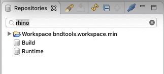

However, we can find this dependency on [Maven Central](https://search.maven.org/search?q=rhino):

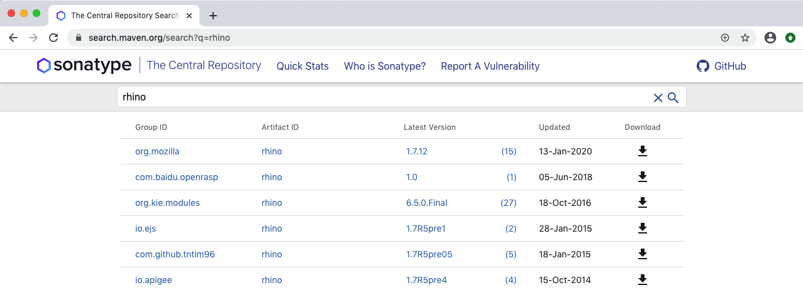

Searching for external dependencies on Maven Central is not always easy. Sadly, many organizations prefer to wrap a bundle when it lacks a feature. This means that finding the right bundle is sometimes wading through a lot of dead bundles. However, in this case, it is clear that at the time of this writing the `org.mozilla:rhino:1.7.12` is _GAV_ coordinates of the proper _artifact_.

A GAV has the following syntax:

GAV ::=  groupId ':' artifactId ( ':' extension ( ':' classifier )? )? ':' version

The `groupId` is an organizational identifier. For example, all bnd code is in the `biz.aQute.bnd` group. The `artifactId` identifies the _program_ name. The version should be clear. One note, in bnd, versions have a proper syntax, that is, `1.2.3` is exactly the same version as `01.02.03`. Maven uses the version string as an opaque identifier and sees `01.02.03` as distinctly different than `1.2.3`.

### Maven Bnd Repository

The workspace template we used uses two repositories that are defined in the `cnf/ext/defaults.bnd` file. These repositories are linked to Maven Central. The Build repository contains artifacts that should never be used in runtime. The Runtime repository can be used to compile against or used in runtime.

We can add the Rhino GAV, `org.mozilla:rhino:1.7.12`, to the Runtime repository. The GAVs for the Runtime repository are stored in the `cnf/ext/runtime.mvn` file. If you open this file, it should look similar to:

```
    org.apache.felix:org.apache.felix.framework:6.0.3
    org.apache.felix:org.apache.felix.framework.security:2.6.1

    org.apache.felix:org.apache.felix.configadmin:1.9.16
    org.apache.felix:org.apache.felix.configurator:1.0.10
    org.apache.felix:org.apache.felix.coordinator:1.0.2
    org.apache.felix:org.apache.felix.eventadmin:1.5.0
    org.apache.felix:org.apache.felix.fileinstall:3.6.4
    org.apache.felix:org.apache.felix.http.servlet-api:1.1.2
    org.apache.felix:org.apache.felix.http.jetty:4.0.14
```

As you can see, these mvn files are a list of GAVs. You can add the `org.mozilla:rhino:1.7.12` GAV in this file and save it. This will automatically update the repositories. Therefore, you can now search in the repositories view.

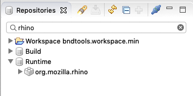

We can now go to the `bnd.bnd` file and select the **Build** and add the `org.mozilla.rhino` dependency on the `-buildpath`. This will add it to the `Bnd Bundle Path` in the Bndtools Explorer.

In the `RhinoEvalImpl.java` source code we can now do the imports and make it compile correctly.

### Gogo Command

To exercise this provider, we want to make it a Gogo command. We therefore need to add `org.apache.felix.gogo.runtime` to the `-buildpath` in the `bnd.bnd` file. The source of the `bnd.bnd` file should look like:

```
    -buildpath: \
        osgi.annotation,\
        org.osgi.service.component.annotations,\
        com.example.eval.api;version=latest,\
        org.apache.felix.gogo.runtime

    -testpath: \
        osgi.enroute.junit.wrapper, \
        osgi.enroute.hamcrest.wrapper
```

Then add the `@GogoCommand` annotation to the `EvalImpl` class.

```java
    @GogoCommand(scope="rhino", function={"eval"})
    @Component
    public class RhinoEvalImpl implements Eval {...}
```

### Running in the Playground

Open the `bnd.bnd` file of the `com.example.playground` project that we created in the starting section. Then select the **Run** tab. In this tab you can add the `com.example.eval.rhino.provider` bundle to the initial requirements.

Select `auto` in the popup menu on the left side of the **Resolve** button. The resolve will then automatically happen on saving the file.


Save the file.

If the framework was still running, the new bundles will automatically be added. We should then immediately be able to run the command:

```
    g! rhino:eval 1+2
    3.0
```

### Summary

In this chapter we created a second provider to the Eval interface. For this provider, we had to find an external dependency on Maven Central. We found the Mozilla Rhino Javascript interpreter. This dependency was added to the `runtime.mvn` file. After saving this file, it became available to add it to the `-buildpath`.

Last, a `@GogoCommand` annotation was added to the component to be able to test it in Gogo.

## Application

### TL;DR

Bndtools supports _executable jars_. These are JARs that contain **all** dependencies and can directly be executed by the Java VM. This section outlines the role of the application project and shows how you can create such an executable JAR.

You may also want to take a look at [Executable JARs](https://bndtools.org/workspace.html#executable-jars).

### Application Bundle

In OSGi, an _application_ is a bundle that acts as the _root_ of a _runtime assembly_. The application is a bundle that is specific for some complete end-user functionality. A very important aspect of an application is that it is a _leaf_ node in a dependency graph, it **must** never required by any other bundle. In a perfect system, this is the only part that is not reusable.

For non-application bundles, it is recommended to minimize dependencies because every dependency makes it harder to use that bundle in different applications. However, the application bundle is free from these constraints. An application can be a web application but also for a specific device configuration. It is the thing that you deploy for your customers.

Applications should only _require_ other code and rarely include any code since that code can never be reused. We, therefore, create a new project that is dedicated to only being an application, it does not contain code.

### Define an Application Project

Create a new project from the `[[empty]](#empty)` template:

```
    com.example.application
```

In this project, create a file called `application.bndrun`. Open it, and go to the **Run** tab.

We now have to establish what needs to be a part of the application. For this example, we drag the following bundles to the `Initial Requirements` list.

```
    org.apache.felix.gogo.command
    org.apache.felix.gogo.shell
    com.example.eval.simple.provider
```

Select a `Resolve mode` of `auto` and then click the **Debug OSGi** to see if the application works.

```
    ____________________________
    Welcome to Apache Felix Gogo
    g! eval 3+5
    8.0
    g!
```

### Executable JAR

To deploy the application we need a file in a deployable _format_. One of the formats supported by `bndrun` files is the _executable JAR_. This format packs a framework and all necessary bundles in a single JAR file. You can export this by adding the following in the `bnd.bnd` file in the `com.example.application` project.

```
    -dependson      *
    -fixupmessages  The JAR is empty
    -export         application.bndrun
```

This will tell bnd to create an executable JAR whenever something changes. (The `-dependson *` makes sure that this is the last project built so that the dependencies are ready when we export them to the executable JAR.)

If you open the `target` directory in a shell, you now see a file `application.bndrun.jar`. This file can directly be run from the command line.

```
    $ cd com.example/com.application.playground
    $ java -jar target/application.bndrun.jar
    g! simple:eval 3+7
    10
    g!
```

### Docker Image

Executable JARs are perfect for a Docker image.

```
    FROM java:8-jdk-alpine
    ADD target/application.bndrun.jar /
    WORKDIR /data
    ENTRYPOINT ["java", "-jar", "/application.bndrun.jar"]
```

You can now build the docker image and run it.

```
    $ docker build .
    Sending build context to Docker daemon  6.456MB
    Step 1/4 : FROM                            ggtools/java8
    ---> f8f0aa8056f4
    Step 2/4 : MAINTAINER                      pkriens@gmail.com
    ---> Using cache
    ---> 0e918347c1f3
    Step 3/4 : CMD                             java -jar application.bndrun.jar
    ---> Using cache
    ---> 9f16d98f80ca
    Step 4/4 : ADD                             target/application.bndrun.jar application.bndrun.jar
    ---> b1559881a6eb
    Successfully built b1559881a6eb
    $ docker run -i    b1559881a6eb
    ____________________________
    Welcome to Apache Felix Gogo
    g! rhino:eval 41+1
    42.0
    g!
```

### Summary

In this chapter we learned about the concept of _executable JARs_: JARs that contain the OSGi framework and all necessary bundles. We then looked at how to build such a JAR and used it to create a Docker image.

## Gradle

### TL;DR

If you are a user of a bnd workspace and there is _build master_ that maintains the low level details then you can skip this section. This is only for build masters.

Bndtools uses Gradle as the _continuous integration_ build tool. Every bnd workspace can automatically be built by Gradle using straight generic templates. The output of this build is identical to the artifacts built in Eclipse or Intellij.

The templates use `gradlew`, which is a small script that fetches the correct version of Gradle. You can start a build typing `./gradlew clean build`, getting a list of the tasks is `./gradlew tasks`.

You may also want to look at [Gradle Integration](https://bndtools.org/workspace.html#gradle-integration)

### Gradle Setup

The workspace template that was used in an earlier session provided a bnd workspace to Bndtools. However, it also included setup for _Gradle_. Gradle is one of the primary build tools, nowadays competing with _maven_ for primacy. The main difference is that Maven is very declarative while Gradle allows fine-grained control using the Groovy or Kotlin language.

This makes it possible to build all the bundles in the workspace, and the application, via the command-line. The primary purpose of this is to build the artifacts on a different system than the developer’s. Before continuous integration on external servers was the norm, many projects found that the application worked on one developer’s machine but not necessarily on another due to a difference in configuration.

### Building

The workspace is set up to build all projects in the workspace directory using the Gradle bnd plugin. This plugin takes the bnd files and tells Gradle how to compile and build the artifacts.

Therefore, to build the workspace, you can do the following:

```
    $ cd  com.example
    $ ./gradlew clean build
    .....
    BUILD SUCCESSFUL in 4s
    13 actionable tasks: 13 executed
```

The bnd Gradle plugin will build exactly the same artifacts as the Eclipse IDE.

Lets try out how the application runs.

```
    $ java -jar com.example.application/target/application.bndrun.jar
    ____________________________
    Welcome to Apache Felix Gogo
    g! eval 41+1
    42.0
```

### Gradle Tidbits

*   There is no need to install Gradle. The workspace template contains two script (`gradlew` for MacOS & Linux, and `gradlew.bat` for Windows) that will download an appropriate Gradle executable.
    
*   You can find out the tasks you can run with `./gradlew tasks`
    
*   By default, Gradle compiles in the same directory as Eclipse/Intellij. This means that they can sometimes override each other’s files. This is only a problem if you build locally with Gradle, which is generally not necessary. If Eclipse is confused, it is likely a Gradle build that destroyed its files.
    

### Using Gradle

The default workspace build with Gradle is driven by the bnd configuration files. Since bnd also runs inside Eclipse and Intellij, there is no need for special Gradle configuration. However, there are situations where you need to generate sources or run some special Gradle plugin. For this reason, each project directory can have a `build.gradle` file that extends the Gradle setup. This can be a lifesaver. However, these gradle files are _not_ run inside the IDE. It is therefore recommended to limit the use of this facility to cases when there is no bnd solution.

### When to Use

The primary purpose of Gradle is to do the CI build on a remote server. However, I’ve noticed that a lot of developers do local builds with Gradle, often from the distrust that the CI build might not be the same. The bnd team sees any discrepancy between the Eclipse IDE and the Gradle build as a high priority error and thus they are rare. Trust Eclipse …​

## Git

### TL;DR

If you have a _build master_ that sets up the workspace for you then this section unnecessary for you. The following sections are only intended for people that need to maintain workspaces.

Currently the workspace is local on our laptop. Today, by far the most widespread solution for a Source Control Management System (SCMS) is Git. In this section we’ll connect the `com.example` workspace to Github and use the Github continuous integration servers (Github Actions) to build it.

You may also want to look at [Github & Actions](https://bndtools.org/workspace.html#github—​actions).

### Fixups

Git does not store empty folders. This is a nuisance for Eclipse since Eclipse will not build a project if a source folder is missing because it was empty. Since on your local system the folder is already created, there is no warning or error. However, when someone else pulls your repository, it will be missing and the workspace won’t build. So you should check that all source folders are not empty. An easy fix is to add an empty `.gitignore` file. For example:

```
    $ touch src/test/java/.gitignore
```

### Init

The following command initializes git for the repository.

```
    $ git init; \
      git add .; \
      git commit -m "first commit"
```

The workspace directory is now a git workspace.

### Store on Github

To safeguard our work, we want to store it in a remote repository. Github is free. If you do not have an account already, [create one](https://github.com/join?source=header-home). Then create a [new repository](https://help.github.com/en/github/creating-cloning-and-archiving-repositories/creating-a-new-repository) with the name `com.example`. You should not initialize the repository with a `` `.gitignore `` file. The `readme` file is optional.

After you’ve created the repository, you get a window that looks more or less like:

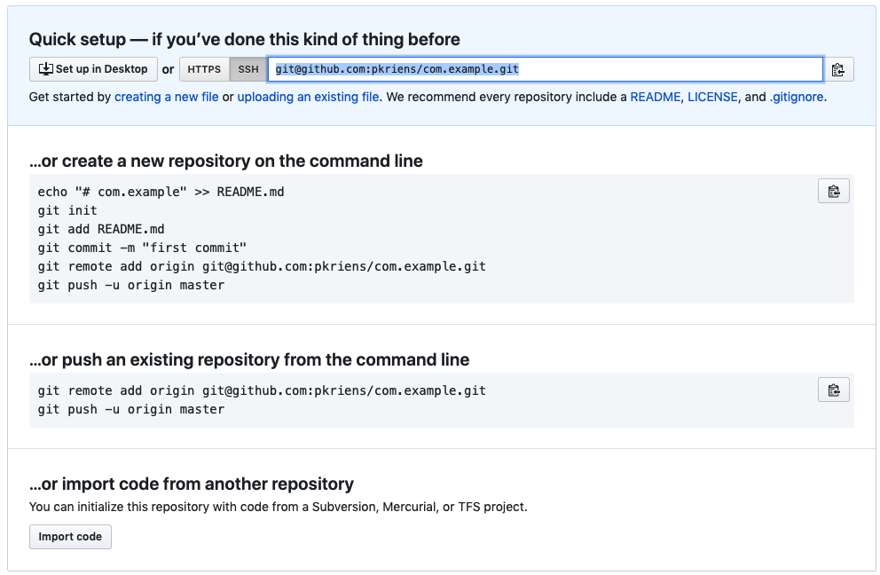

We have an existing repository so you should copy the lines after **…or push an existing repository from the command line**.

This should be similar to the following but instead of `pkriens` you should use your Github user name.

```
    $ git remote add origin git@github.com:pkriens/com.example.git; \
      git push -u origin master
    54 files changed, 2150 insertions(+)
    create mode 100644 .gitattributes
    create mode 100644 .github/workflows/cibuild.yml
    create mode 100644 .gitignore
    create mode 100644 .gradle-wrapper/gradle-wrapper.jar
    create mode 100644 .gradle-wrapper/gradle-wrapper.properties
    create mode 100644 .travis.yml
    create mode 100644 LICENSE
    create mode 100644 cnf/.classpath
    ........
    create mode 100755 gradlew
    create mode 100644 gradlew.bat
    create mode 100644 settings.gradle
    $
```

If you can now go to the Github repository at [https://github.com/pkriens/com.example](https://github.com/pkriens/com.example) (don’t) forget to change to your user name).

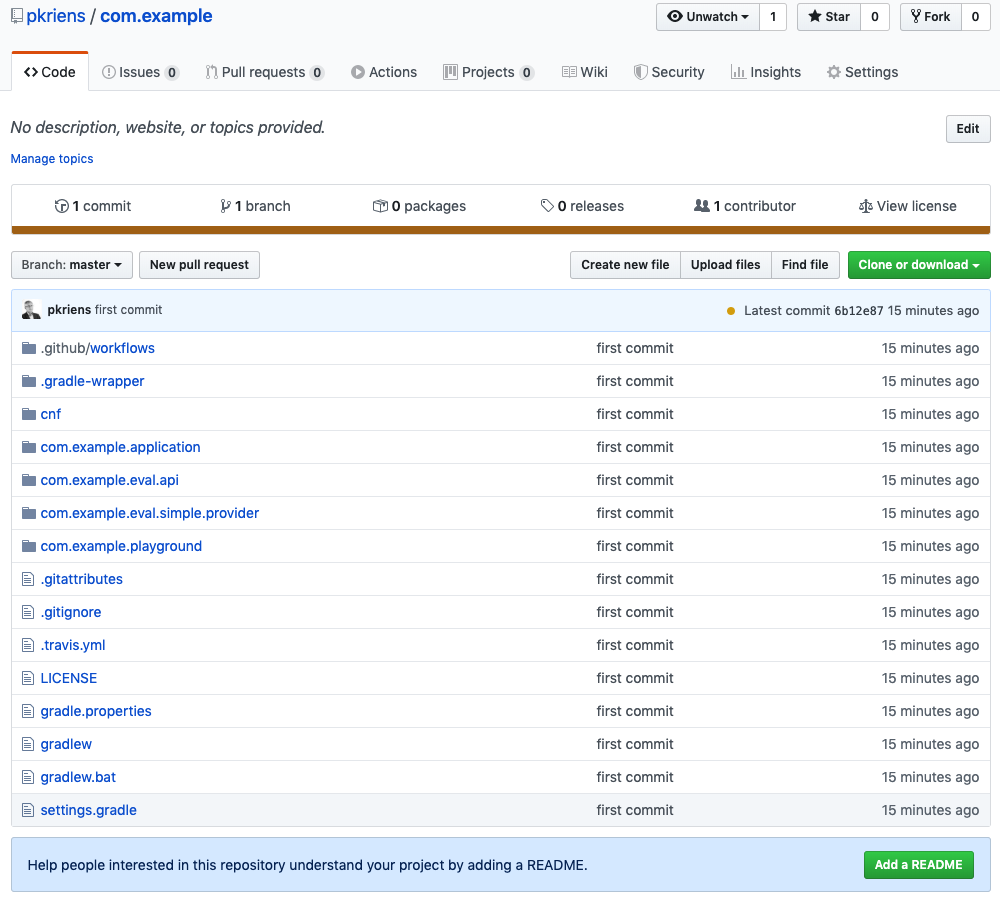

### Github Workflow Actions

Reliable software must always be built on a server. Github has support for Continuous Integration (CI) with their `Actions` feature. By adding a _workflow_ configuration to your workspace, your code can automatically be built. Our template already contained such a workflow.

The `.github/workflow` directory contains a file called `build.yml`:

```
    name: Build

    on:
        push:
        pull_request:

    env:
        LC_ALL:       en_US.UTF-8
        GRADLE_OPTS: -Dorg.gradle.parallel=false

    jobs:
        build:
            name:     build on OpenJDK Linux
            runs-on:  ubuntu-latest
            steps:
            -   name: Git Checkout
                uses: actions/checkout@v1
            -   name: Set up Java
                uses: actions/setup-java@v1
                with:
                    java-version: 1.8
            -   name: Build
                shell: bash
                run: ./gradlew build
```

This file instructs Github to react to a `push` or `pull_request` event in the repository. It will execute all jobs that are defined in this workflow file. The Yaml file also defines a number of environment properties.

In this case, there is a single job that compiles with the OpenJDK Java on Linux. Github also supports MacOS and Windows. The steps in the workflow are checkout, setup Java, and the build is running gradle in a bash shell. It is surprisingly simple.

If you click on the **Actions** above your repository window, you should see that the repository has been built.

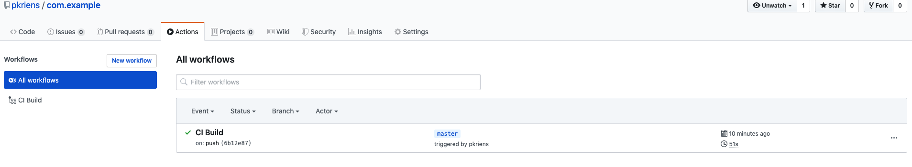

If you click on the **CI Build** link, you can get access to the build log.

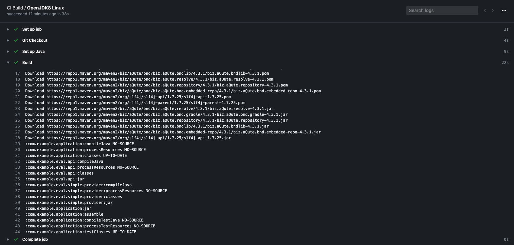

## Release to Remote Repository

### TL;DR

If you are a user of a bnd workspace and there is _build master_ that maintains the low level details then you can skip this section. This is only for build masters.

To be able to share bundles, it is necessary to _release_ a workspace to a remote repository. This chapter shows how the bundles in a workspace can be released to Sonatype’s Open Source repository. You will be shown how to do snapshot releases and releasing a final release to Maven Central using _staging_.

### Maven Repositories

Maven repositories have become the de-facto standard in our industry. Maven Central is the largest open source repository for Java. Therefore, bnd has extensive support for releasing to Maven Nexus and Artifactory repositories.

Maven has the concept of _snapshots_. These are revisions that are not released yet. Whether an artifact in a build is a snapshot or a release is defined by the version. If the version ends with `SNAPSHOT`, bnd will assume it must be released as a snapshot version, otherwise it will released it as a final release.

The normal process is then to release a snapshot version. Therefore, in `cnf/build.bnd`, change the `Bundle-Version` into a snapshot version.

```
        Bundle-Version                                1.0.0.SNAPSHOT
```

We also want to make sure the version for Maven is consistently formatted. In OSGi, versions can be written differently but are treated as the same version whereas in Maven a version is an opaque identifier.

```
        -pom:                   version=${versionmask;===s;${@version}}
```

The `${@version}` is set by the pom generator when this macro is expanded. It is the version calculated for the bundle itself. This allows us to slightly tweak the version. We are using the major, minor, and micro part but then only add the snapshot part if present. We ignore the qualifier. This is a timestamp and does not work well with Maven.

A release to Maven Central will require _staging_. With staging, a temporary repository is created with all the artifacts. The files are then signed in that repository. Before you can release to Maven Central, a verification process will validate each artifact. If the verification process accepts the temporary repository, it can be promoted to Maven Central.

Releasing should not be done from a local developer’s machine so as to avoid depending on a local set up. The best place to release is from a remote service. In this example, we will use Github Actions to release to the [https://oss.sonatype.org](https://oss.sonatype.org) server.

### Release Repository

To release, we need a release repository. This is a Maven Bnd Repository that is listed in the `-releaserepo` instructions. Enter the following information in the `cnf/build.bnd` file.

```
  -plugin.8.nexus: \
    aQute.bnd.repository.maven.provider.MavenBndRepository; \
        snapshotUrl = 'https://oss.sonatype.org/content/repositories/snapshots/'; \
        releaseUrl  = 'https://oss.sonatype.org/service/local/staging/deploy/maven2/'; \
                noupdateOnRelease=true; \
        name="Sonatype"

  -releaserepo                Sonatype
```

### Authentication

Sonatype recommends rather strongly to create an authentication token. To create such a token, you need to login to [Sonatype Nexus](https://oss.sonatype.org). This requires an account that you can register on their [website](https://central.sonatype.org/pages/ossrh-guide.html).

#### Group Id

To get a username and a password, you need to claim a _groupid_. The group id is a unique name for your part of the repository. In this example, we’ll use `biz.aQute.example` since I own the `biz.aQute` group prefix. However, you will need your own group id.

We need to register the group id with bnd in the `cnf/build.bnd` file.

```
        -groupid                                        biz.aQute.example
```

#### Username & Password

Once you are logged in, click on your user name in the right top, and select **Profile**. Then select the pop menu in the left **User Token**. There you can create a user token. This consists of two parts, a user name and a password. In the rest of the text, these parts are called `SONATYPE_USERNAME` and `SONATYPE_PASSWORD`.

### Connection Settings

Since we will be releasing from a continuous integration server, we cannot use the local authentication provided by the bnd [connection settings](https://bnd.bndtools.org/instructions/connection-settings.html). These settings only works locally on your own computer. However, we can also define the connection settings also in the bnd file. Since passwords cannot be stored in the source code for obvious reason, we are going to assume that these secrets are available as _environment variables_. Environment variables allow us to test the release process locally but they can also be used by Github Actions, Travis, and other continuous integration services.

To pass the environment variables to bnd, we need the `-connection-settings` instruction in `cnf/build.bnd`.

```
        -connection-settings: \
                server; \
                        id=https://oss.sonatype.org; \
                        username=${env;SONATYPE_USERNAME;}; \
                        password=${env;SONATYPE_PASSWORD;}, \
                bnd
```

### Local Test Snapshots

Everything is now set up to release a snapshot to the Sonatype snapshot repository. To test this, we can go to the shell and use `gradlew` to release.

```
        $ cd com.example
        $ export SONATYPE_USERNAME=...
        $ export SONATYPE_PASSWORD=...
        $ ./gradlew clear release
```

This will release the whole workspace to the snapshot repository.

Looking at the output, we see that the `com.example.playground` project was also built. We can disable releasing this project by overriding the `-releaserepo` in the `bnd.bnd` file of the `com.example.playground` project.

```
        -releaserepo:
```

### Github Actions

Github automatically builds both PRs and all commits to the master branch. For PR’s we want to trigger a build so we can run the tests and validate the PR. However, if we commit to `master`, we want to run the release process. The template gave us the following workflow document in `.github/workflows/build.yml` in the root of our workspace:

```
        name: CI Build

        on:
                push:
                pull_request:

        env:
                LC_ALL:       en_US.UTF-8
                GRADLE_OPTS: -Dorg.gradle.parallel=false

        jobs:
                build:
                        name:     build on OpenJDK Linux
                        runs-on:  ubuntu-latest
                        steps:
                        -   name: Git Checkout
                                uses: actions/checkout@v1
                        -   name: Set up Java
                                uses: actions/setup-java@v1
                                with:
                                        java-version: 1.8
                        -   name: Build
                                shell: bash
                                run: ./gradlew build
```

We can modify this to only run on a non-master commit. We can then add a second workflow file for commits on the master branch.

For the original file, we only need to change the event section that is listed under the `on:` attribute:

```
        on:
                push:
                        branches-ignore: ['master']
                pull_request:
```

### Github Secrets

We now need to register our SONATYPE\_USERNAME and SONATYPE\_PASSWORD with Github. You can add these secrets via the `Settings` of the repository. If you select the repository `Settings` page and then select the `Secrets` entry.

In the `Secrets` section you can add the SONATYPE\_USERNAME and SONATYPE\_PASSWORD secrets.

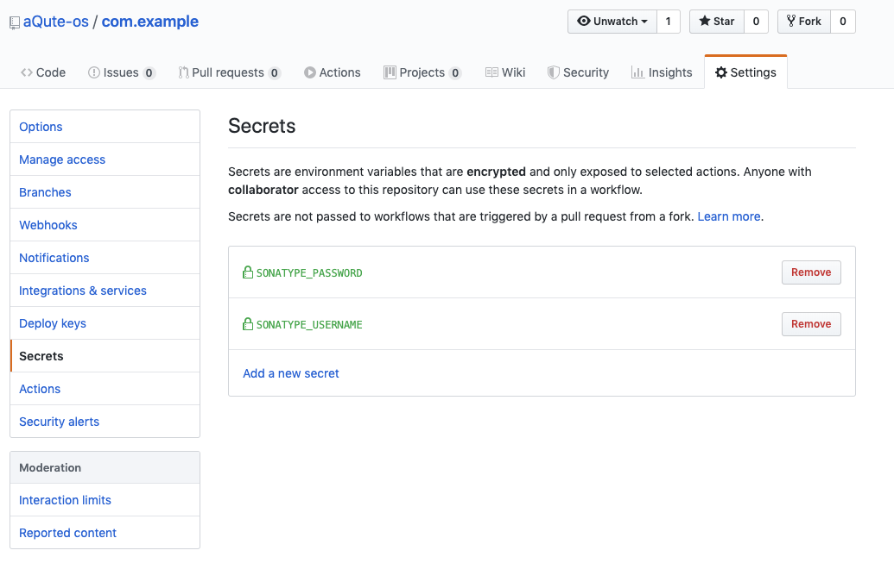

We will now have to add the environment variables to the `.github/workflows/build.yml` file.

```
        env:
                LC_ALL:       en_US.UTF-8
                GRADLE_OPTS: -Dorg.gradle.parallel=false
        SONATYPE_USERNAME: {{ secrets.SONATYPE_USERNAME }}
                SONATYPE_PASSWORD: {{ secrets.SONATYPE_PASSWORD }}
```

### Release Workflow

From now on, this will not run when we commit on the master branch. For this, we add a second workflow file that is called `.github/workflows/release.yml`. This is a copy of the `.github/workflows/build.yml` with only the `on`, `env`, and `run` section slightly changed.

```
        name: CI Release

        on:
                push:
                        branches: [ 'master']

        env:
                LC_ALL:       en_US.UTF-8
                GRADLE_OPTS: -Dorg.gradle.parallel=false
        SONATYPE_USERNAME: {{ secrets.SONATYPE_USERNAME }}
                SONATYPE_PASSWORD: {{ secrets.SONATYPE_PASSWORD }}

        jobs:
                build:
                        name:     build on OpenJDK Linux
                        runs-on:  ubuntu-latest
                        steps:
                        -   name: Git Checkout
                                uses: actions/checkout@v1
                        -   name: Set up Java
                                uses: actions/setup-java@v1
                                with:
                                        java-version: 1.8
                        -   name: Build
                                shell: bash
                                run: ./gradlew release
```

We can now commit the workspace to Git and check the Actions. Since this is a commit on the master branch, the release workflow will automatically be triggered.

Some common pitfalls:

*   Tabs instead of spaces, YAML files want spaces
    
*   Entering the secrets in the wrong repository
    

### POM Generation

The POM is generated by bnd. It uses as much information as possible from the OSGi manifest headers, including the `groupId` instruction we set earlier.

The POM generator uses the following Manifest headers to create the POM.

*   Bundle-SymbolicName – The `artifactId`.
    
*   Bundle-Name – The `name`.
    
*   Bundle-Description – Goes into the POM description.
    
*   Bundle-DocURL – The `url` element.
    
*   Bundle-Vendor – Organization name and url. The url part is set if the header ends in an http or https url.
    
*   Bundle-License – Added as license.
    
*   Bundle-SCM – Source Control Management. All attributes are expanded as elements.
    
*   Bundle-Developers – Defines the developers.
    

An example of headers that work:

Bundle-Vendor:    		OSGi Alliance http://www.osgi.org/
Bundle-Copyright: 		${copyright}
Bundle-License: 		http://opensource.org/licenses/apache2.0.php; \\
                			link="http://www.apache.org/licenses/LICENSE-2.0"; \\
                			description="Apache License, Version 2.0"
Bundle-DocURL:    		https://v2archive.enroute.osgi.org
Bundle-SCM:       		url=https://github.com/osgi/osgi.enroute, \\
                  			connection=scm:git:https://github.com/osgi/osgi.enroute.git, \\
                  			developerConnection=scm:git:git@github.com:osgi/osgi.enroute.git
Bundle-Developers: 		osgi; \\
							email=info@osgi.org; \\
							name="OSGi Alliance"; \\
							organization="OSGi Alliance"

The Bundle-SCM and Bundle-Developers headers are not OSGi standardized but they are necessary to release to Maven Central.

Releasing a non-snapshot release will automatically create the javadoc and sources jars.

### Releasing

To release the workspace, we need to perform a number of steps.

*   Remove the `-SNAPSHOT` from the Bundle-Version in `cnf/build.bnd`
    
*   Commit the change in `cnf/build.bnd`
    
*   Tag the commit with the version
    
*   Push the commit and tag to the master branch
    
    *   Automatically build on Github Actions
        
    
*   Add the `-SNAPSHOT` again to the Bundle-Version in `cnf/build.bnd`
    
*   Commit the changes
    
    *   Automatically build on Github Actions
        
    

The first build will be a release build because the Bundle-Version does not contain `SNAPSHOT`. This will release to a _staging_ repository. A staging repository is automatically created on a Nexus server. The name is therefore unknown. You will have to login to the Sonatype Nexus server and check the **Staging Repositories**. Normally, you should see a repository that contains your group id name and a number. There might be many other staging repositories in this list.

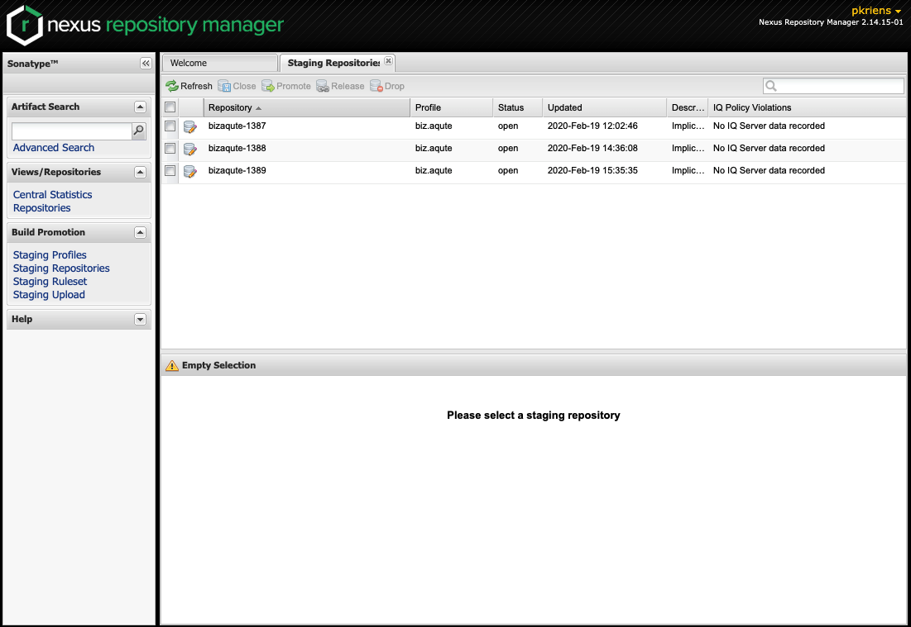

### Signing

To release to Maven Central it is necessary to sign the files in the staging repository. The easiest way to do this is with the [bnd _command line_ tool](https://github.com/bndtools/bnd/wiki/Install-bnd-on-the-command-line). The `bnd nexus` command can retrieve the files from the repositories, calculate the signature, and then upload the signatures.

The command uses the URL to the staging repository. This is generally a name with your mangled group id prefix and a number to make it unique. You can find this name on the Sonatype OSS Nexus under the [Staging Repositories](https://oss.sonatype.org/#stagingRepositories) as discussed earlier. For example, `bizaqute-1387`. This is url is for the `-u` option.

You will need a [GPG and a key](https://blog.sonatype.com/2010/01/how-to-generate-pgp-signatures-with-maven/) for signing the artifacts.

```
        $ bnd nexus -u https://oss.sonatype.org/service/local/repositories/bizaqute-1387 sign
        Passsword for pgp: ************
```

The sign command will download all files and sign them locally. It then uploads the `asc` file to nexus. This keeps your GPG key local.

### Closing the Staging Repository

On the Sonatype Nexus you can now close the repository. This will trigger a validation. If this succeeds you can release the staging repository. This will copy your files to Maven Central.

The validation process can be picky.

### Summary

In this chapter we created a Github Actions set up that released snapshots to the Sonatype OSS repository for every commit on the master branch. We then showed how to create a release version in a Sonatype staging repository.

## The End

You’ve reached the end of this tour. If you’ve tried out all the examples then you should be able to get started with your own workspace and take advantage of OSGi.

If you’ve a relatively small workspace with straightforward repositories then this book should probably suffice. The [bnd manual](https://bnd.bndtools.org) has always been bnd’s weak point but it is definitely improving. There are an extensive [instruction index](https://bnd.bndtools.org/chapters/825-instructions-ref.html) and [macro index](https://bnd.bndtools.org/chapters/855-macros-ref.html) that are actually becoming quite useful.

A tremendously valuable resource is the [bnd workspace itself](https://github.com/bndtools/bnd). This is a complex workspace that uses a large number of state of the art bnd features itself. The [Bndtools mailing list](https://bndtools.org/community.html) can be used to ask questions. Some simpler workspaces are for example [aQute util](https://github.com/aQute-os/biz.aQute.osgi.util) and [Bndtools Support for Remote Services Development](https://wiki.eclipse.org/Bndtools_Support_for_Remote_Services_Development). If you’re an OSGi member, look at the OSGi build, it is also based on Bndtools.

If you’re evaluating Bndtools to be used as replacement for a non-trivial system then you might want to [contact me](mailto:Peter.Kriens@aQute.biz). Converting a large build always contains many pitfalls and we might be able to save you a lot of work. Especially when you’re using PDE and want to enjoy OSGi, we could help a lot since we developed some software to automate the conversion.

Last but not least, I am working on a book that dives much deeper into the OSGi aspects. Unfortunately, most of the OSGi books in the market are old and do not leverage Declarative Services. If you follow me on Twitter at `@pkriens` then I’ll keep you posted.

[Peter Kriens](mailto:peter.kriens@aQute.biz)
